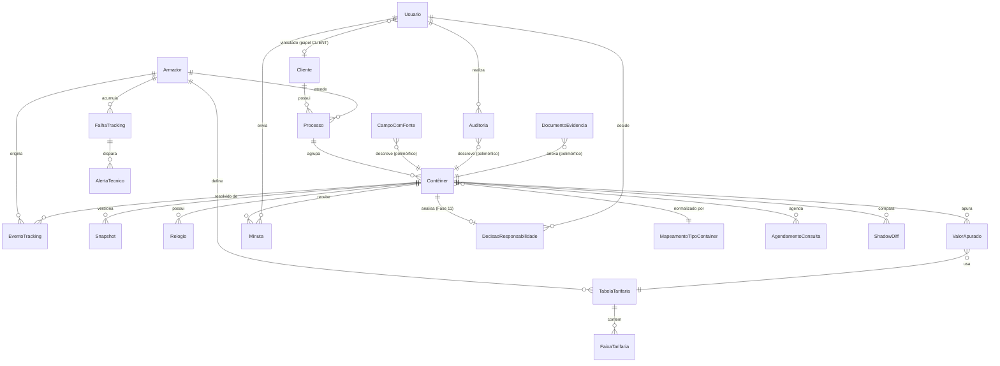

# Plano de Migração — Demurrage V1 → Demurrage Engine V2

**Data:** 23/09/2026 (revisão 2)
**Base:** `docs/demurrage-blueprint-gap-analysis.md` (diagnóstico aprovado, com as 3 correções de premissa abaixo)
**Status:** plano aprovado em linhas gerais. Esta revisão incorpora 7 ajustes pedidos após a primeira aprovação (lista abaixo) e encerra a rodada de planejamento — a partir daqui, só a Fase 1 é iniciada (fundação persistente), começando pela apresentação do schema para aprovação, sem escrever migrations.

## Ajustes incorporados nesta revisão

1. Estratégia explícita de bootstrap/backfill para processos já ativos na virada para V2 — nada ausente é inventado, tudo vira pendência rastreável (ver Fase 1).
2. Contrato do Tracking Service expandido: timestamp da coleta, fonte/armador, identificador original do evento, status da consulta e referência ao dado bruto para auditoria (ver Fase 5).
3. Princípio de arquitetura explícito: a Demurrage V2 é exclusivamente consumidora do Tracking Service central — nunca acessa Scrapfly ou o armador diretamente (ver abaixo e Fase 5).
4. Shadow mode adicionado antes do corte de frontend: V1 permanece produtiva enquanto V2 calcula os mesmos processos em paralelo, só para comparação (ver "Estratégia de coexistência e corte").
5. Idempotência explícita para scheduler, ingestão de eventos e alertas — contra execução/disparo duplicado (ver Fases 5 e 6).
6. Fixtures oficiais de cálculo como pré-requisito bloqueante das Fases 2–4, cobrindo off-by-one, House×Master, múltiplos contêineres, mudança de faixa, Empty Return, minuta e tabelas provisórias (nova seção antes da Fase 2).
7. Separação explícita dos três motores comerciais (Termo por Embarque, Termo Único, Exposição Rocket) como estratégias distintas, não uma função genérica (ver Fase 4).

## Correções de premissa incorporadas (vs. o diagnóstico anterior)

1. **Tracking de armador já existe na Priora** fora deste repositório/módulo. Não será construído um novo scraper/integração. Ver "Busca realizada" e "Contrato assumido" na Fase 5.
2. **Liberação é desacoplada.** A pré-análise de responsabilidade Rocket × cliente (Cap. 26 do Blueprint) não bloqueia o Demurrage Core. Ela entra como módulo plugável na Fase 11, consumindo eventos estruturados da Liberação quando existirem — sem gate no fechamento operacional (Fase 8).
3. **RBAC inicial:** `ANALYST`, `MANAGER`, `ADMIN`, `CLIENT`. "Responsável técnico/desenvolvedor" deixa de ser um papel de sistema e passa a ser um **destinatário configurável de alertas técnicos** (lista de e-mail/webhook em configuração, sem login nem permissões no app).

## Princípio geral: sem reescrita destrutiva

A V1 (`src/demurrage/*`, `src/routes/demurrageRoutes.ts`, `public/Demurrage.dc.html`, `public/PortalCliente.dc.html`) **permanece intocada e funcional** até o momento explícito de corte descrito na seção "Estratégia de coexistência e corte" mais abaixo. A V2 nasce em um namespace novo (`src/demurrage-engine/*` — nome proposto, ajustável), com sua própria rota (`/api/demurrage/v2` ou equivalente), sua própria persistência e seus próprios testes, sem tocar nos arquivos da V1 até que uma fase específica diga explicitamente "agora sim, isto afeta a V1".

## Princípio de arquitetura: única porta de saída para tracking

A partir da Fase 5, **toda** a Demurrage V2 (motor, scheduler, UI, Gestão) consome tracking exclusivamente através do Tracking Service central da Priora. Nenhum código de `src/demurrage-engine/*` faz — nem pode fazer — chamada direta a Scrapfly, a um endpoint de armador, ou a qualquer scraper. O adaptador `armadorTrackingSource.ts` (Fase 5) é a única peça do sistema autorizada a conhecer a existência do Tracking Service; todo o resto do motor conhece apenas a porta `ContainerDataSource` (Fase 1), agnóstica de onde o dado veio. Isso vale também para o scheduler (Fase 6): ele decide **quando** pedir uma atualização, nunca **como** — o "como" é sempre delegado ao mesmo adaptador único.

Cada fase abaixo segue este roteiro fixo: **objetivo · arquivos/modelos novos · arquivos existentes afetados · migrations · dependências · testes obrigatórios · condição de aceite · risco de regressão.**

---

## Busca realizada para a correção #1 (tracking de armador)

Antes de propor a Fase 5, busquei o conector/serviço existente:
- Grep completo neste repositório por armador/carrier/MSC/Maersk/Hapag/CMA CGM/ONE/Evergreen/COSCO/OOCL/ZIM/Yang Ming/HMM/PIL/vessel/discharge/gate out/empty return — **nenhum resultado fora de listas de palavras-chave de e-mail** (`demurrageFilters.ts`, `auditoria/*`). O único tracking real implementado é `src/fedex/fedexClient.ts` e `src/dhl/dhlClient.ts` (courier de encomenda, domínio diferente).
- `render.yaml` não referencia nenhum serviço de tracking de armador nem variável de ambiente correspondente.
- Verifiquei os outros dois repositórios visíveis nesta sessão (`alvaroh2903-star/desktop-tutorial`, `alvaroh2903-star/miamoohelem`) — nenhum tem relação com logística/tracking (um é um stub vazio do tutorial do GitHub Desktop, o outro é uma loja de bebidas/sobremesas em React+Supabase).

**Conclusão:** o serviço existe, mas **fora do alcance desta sessão** (outro repositório/serviço interno da Priora não conectado aqui). A Fase 5 não pode nomear o serviço com certeza — ela define o **contrato de consumo assumido** e trata a obtenção de acesso/documentação real como pré-condição de início da fase, não como parte do escopo de código da fase.

---

## Trilhos transversais (não são fases numeradas, mas correm em paralelo)

Estes dois trilhos não aparecem na lista de 12 fases do pedido, mas são pré-requisito de ações específicas dentro delas — por isso ficam registrados aqui em vez de forçar uma 13ª fase:

**T1 — RBAC (`ANALYST`/`MANAGER`/`ADMIN`/`CLIENT`) + auditoria genérica.**
Necessário *antes* de qualquer ação com gate de papel aparecer em fases posteriores: atualização manual de tracking (Fase 6, exclusiva de `MANAGER`/`ADMIN`), correção de dado crítico e reabertura de processo (Fase 8), e a própria existência do papel `CLIENT` como pré-condição do Portal (Fase 12). Pode ser desenvolvido em paralelo às Fases 1–4, já que é ortogonal ao motor de cálculo. Não altera `requireAuth.ts` da V1 nem nenhuma rota existente — nasce como camada nova (`src/auth/roles.ts` ou `src/demurrage-engine/rbac/`) que só passa a ser consumida pelas rotas novas da V2.

**T2 — Alertas técnicos configuráveis.**
Lista de destinatários (e-mail/webhook) configurada via `config.ts`/variável de ambiente (ex.: `TRACKING_ALERT_RECIPIENTS`), consumida pela Fase 6 (3 falhas consecutivas → alerta ao `MANAGER` responsável pelo processo + a esses destinatários técnicos). Não é um papel de RBAC, é config pura — sem tela de gestão de usuário associada nesta V1 do RBAC.

---

## Fase 1 — Modelo persistente por contêiner

**Objetivo:** substituir o "recalcula tudo a cada `GET`" por um registro persistente e versionado por contêiner, que é o alicerce de todas as fases seguintes. Introduzir a abstração de fonte de dados (`ContainerDataSource`) já prevista para acomodar, mais tarde, o Tracking Service real (Fase 5) sem retrabalho.

**Arquivos/modelos novos:**
- `src/demurrage-engine/domain/container.ts` (entidade Contêiner: processo, número, tipo original+normalizado, armador, House/Master BL, estado, prioridade+motivo, timestamps).
- `src/demurrage-engine/domain/snapshot.ts` (fotografia versionada — Cap. 14 do Blueprint).
- `src/demurrage-engine/domain/sourcedField.ts` (`DadoComFonte<T>`: valor, fonte, timestamp, fonte alternativa, divergência).
- `src/demurrage-engine/sources/containerDataSource.ts` (porta/interface).
- `src/demurrage-engine/sources/emailHeuristicSource.ts` (adaptador que **reaproveita** `demurrageFilters.ts` + `demurrageParser.ts` da V1 como fonte de contingência — ver nota abaixo).
- `src/demurrage-engine/persistence/containerRepository.ts` (camada de acesso a dados, interface + implementação inicial).

**Arquivos existentes afetados:** nenhum é modificado. `demurrageFilters.ts` e `demurrageParser.ts` são **importados/reaproveitados** por `emailHeuristicSource.ts`, não alterados — eles continuam servindo a V1 exatamente como hoje.

**Migrations:**
- Decisão de motor de persistência a ser tomada no início da fase (não é uma "migration" em si, é pré-requisito dela): hoje a Priora não tem banco algum, só arquivos JSON planos (`.data/*.json`). Duas opções compatíveis com a infra atual (Render free, sem serviço de banco externo hoje): (a) SQLite em arquivo (ex.: `better-sqlite3`) — mesma filosofia "disco local" já usada por sessão/minutas; (b) Postgres, se/quando a Priora provisionar um serviço de banco. Esta escolha é bloqueante para o início do código da fase, mas não para o desenho — o plano assume uma interface `ContainerRepository` que funciona com qualquer um dos dois.
- Schema inicial: tabelas/coleções de `container`, `snapshot`, `sourced_field` (genérica ou embutida no `container`) — proposta completa na seção "Schema proposto — Fase 1" ao final deste documento, para aprovação antes de qualquer migration ser escrita.
- **Backfill (não é migração de schema, é carga inicial):** rodar `emailHeuristicSource` uma vez sobre as threads atualmente identificadas pela V1 para popular a base V2 com um estado inicial equivalente ao que a V1 mostra hoje; e importar os registros existentes de `demurrage-minutas.json`/`demurrage-atividades.json` (via `procKey`) para os novos registros de contêiner/processo, preservando o que já foi feito operacionalmente (ex.: "minuta já solicitada" não pode ser perdido na virada).

**Estratégia de bootstrap para processos já ativos (ponto de atenção explícito):**
Quando a V2 entra em operação, já existem processos em pleno andamento (contêiner descarregado há dias, alguns já em demurrage) que a V1 está acompanhando via e-mail. O backfill **não inventa histórico que não existe**:
- Para cada contêiner identificado pela V1 hoje, o backfill cria o contêiner V2 com os campos que a heurística de e-mail conseguir extrair **no momento do backfill**, cada um com `fonte = 'email_heuristic'` e `status = 'preenchido'`.
- Todo campo que a V1 mostra como "a confirmar" (ou que a heurística de e-mail nunca conseguiu extrair) nasce na V2 com `status = 'pendente'` e `valor = null` — nunca um valor plausível é fabricado para preencher a lacuna, mesmo que isso signifique que o contêiner nasça com o relógio do cliente ou da Rocket incompleto.
- **Não há tentativa de reconstruir a data de descarga retroativa** a partir de heurísticas (ex.: "data do primeiro e-mail que menciona o contêiner"). Se a Fase 5 (Tracking Service) ainda não estiver acoplada no momento do backfill, `dataDescarga` nasce `pendente` para todo contêiner cuja única fonte disponível seja e-mail — mesmo que o texto do e-mail mencione uma data de retirada/Gate Out (esse valor vai para o campo correto, não é usado como substituto silencioso da descarga).
- Cada execução do backfill grava um registro em `BackfillRun` (ver schema) com contagem de processos processados, campos marcados como pendentes e erros — para auditoria de quando/como cada contêiner "nasceu" na V2.
- O backfill é **idempotente**: reexecutá-lo sobre o mesmo conjunto de threads não duplica contêineres nem regride um campo já promovido a uma fonte melhor (ex.: se a Fase 5 já tiver preenchido `dataDescarga` via tracking real, uma nova rodada de backfill de e-mail não pode sobrescrever esse valor — a hierarquia de fontes do Cap. 4 vale desde o primeiro backfill).

**Dependências:** decisão de motor de persistência (acima); nenhuma dependência de Fase 5 (Tracking Service) — a fonte inicial é a heurística de e-mail, tratada desde já como fonte de **contingência**, não prioritária (alinhado ao Cap. 4 do Blueprint: quando a Fase 5 acoplar o Tracking Service real, ele entra como fonte prioritária sem precisar redesenhar o modelo).

**Testes obrigatórios:**
- CRUD do repositório de contêiner com versionamento de snapshot (nova versão preserva a anterior, não sobrescreve).
- `emailHeuristicSource` produzindo o mesmo resultado que a V1 produz hoje para o mesmo conjunto de e-mails de teste (teste de caracterização, para garantir que a base V2 nasce equivalente à V1 e não diverge por acidente nesta fase).
- Backfill idempotente (rodar duas vezes não duplica registros nem regride campo já promovido a fonte melhor — teste explícito desse cenário).
- Teste dedicado de "nada é inventado": para um contêiner sem `dataDescarga` em nenhuma fonte disponível no momento do backfill, o campo nasce `pendente`/`null`, nunca com um valor derivado de heurística de data de e-mail.

**Condição de aceite:** para um conjunto de threads de teste, a base V2 populada via backfill contém um contêiner por número de contêiner extraído, com o `DadoComFonte` de cada campo preenchido com fonte `email_heuristic` (ou `pendente`, quando não encontrado) e o mesmo valor que a V1 mostraria hoje; e um `BackfillRun` registrado com as contagens da execução.

**Risco de regressão:** **nulo para a V1** (nenhum arquivo da V1 é alterado). Risco interno: erro no backfill pode gerar uma base V2 inconsistente — mitigado por rodar o backfill em ambiente de teste antes de qualquer uso real, por ele ser reexecutável (idempotente) sem side effect na V1, e pelo registro em `BackfillRun` permitir auditar exatamente o que cada execução fez.

---

## Fixtures oficiais de cálculo — pré-requisito bloqueante das Fases 2–4

Antes de escrever qualquer código das Fases 2, 3 e 4, um conjunto único de fixtures oficiais deve existir e ser revisado — todas as três fases (motor temporal, dois relógios, motor tarifário) são testadas contra o **mesmo** conjunto de casos, para garantir que não há divergência de premissa entre elas. As fixtures cobrem, no mínimo:

1. **Off-by-one:** a tabela literal do Cap. 23.1 do Blueprint (descarga 01/09, FT 14 dias → 14/09:0, 15/09:1, 16/09:2, 20/09:6), mais um caso de FT=0 confirmado e um caso de FT ausente (pendente).
2. **House × Master divergentes:** um contêiner onde o relógio do cliente vence antes do relógio da Rocket, outro onde é o inverso, e um onde os dois vencem no mesmo dia.
3. **Múltiplos contêineres por processo:** um processo com 3 contêineres em estados diferentes (um devolvido sem custo, um em demurrage, um ainda dentro do free time) — para validar que a consolidação no processo preserva o detalhamento individual (Cap. 3/25) e não "contamina" um contêiner com o estado de outro.
4. **Mudança de faixa tarifária:** um contêiner cujo free time é maior que o padrão da tabela do armador, fazendo a primeira diária cair numa faixa que não é a primeira (exemplo do Cap. 24), tanto para Termo Único (faixas paralelas ao FT) quanto para a tabela de armador (Cap. 24.3.1).
5. **Empty Return:** evento chegando antes da descarga (caso inválido, Cap. 31.5), evento com data retroativa recebido atrasado (Cap. 31.6), e o caso normal (encerra os dois relógios daquele contêiner, não afeta os demais do mesmo processo/BL).
6. **Minuta:** minuta com data igual ao Empty Return (caso trivial), minuta com data divergente (preserva as duas evidências, usa a da minuta), e minuta chegando depois de um fechamento sem custo, criando custo (vai para reabertura).
7. **Tabelas provisórias/incompletas:** um cálculo com a tabela da PIL (estimativa por ponto médio, sempre `ESTIMATED_PROVISIONAL`) e um com uma tabela incompleta (Yang Ming/COSCO/ZIM) caindo numa faixa sem dado (`UNAVAILABLE`, nunca aproximação por semelhança).

Essas fixtures vivem em um único local compartilhado (ex.: `src/demurrage-engine/__fixtures__/casos-oficiais.ts` ou equivalente em JSON) e são referenciadas pelos testes das Fases 2, 3 e 4 — não duplicadas em cada fase. Nenhuma dessas fixtures é escrita nesta etapa (a instrução desta rodada é iniciar apenas a Fase 1); elas ficam registradas aqui como o primeiro entregável de código da Fase 2, antes de qualquer linha do motor temporal.

---

## Fase 2 — Motor temporal e testes de off-by-one

**Objetivo:** implementar (e testar exaustivamente) a fórmula de contagem de dias do Cap. 6/23 do Blueprint, corrigindo os dois problemas identificados no diagnóstico: âncora temporal (`dataDescarga`, não `dataRetirada`) e o aparente off-by-one da V1. Este motor é **puro** — funções de data determinísticas, sem dependência de fonte de dados real, testável isoladamente por fixtures.

**Arquivos/modelos novos:**
- `src/demurrage-engine/temporal/freeTimeClock.ts` (cálculo de último dia livre, primeiro dia de demurrage, dias cobrados, dada uma data-âncora + N dias de free time + data final de apuração).
- `src/demurrage-engine/temporal/freeTimeClock.test.ts`.

**Arquivos existentes afetados:** nenhum.

**Migrations:** nenhuma além de, no modelo do Cap. 1, acrescentar o campo `dataDescarga` (como `DadoComFonte<Date>`) à entidade Contêiner da Fase 1 — `dataRetirada`/Gate Out passa a ser um campo informativo separado, não a âncora de cálculo.

**Dependências:** Fase 1 (entidade Contêiner existir para o campo `dataDescarga` ter onde morar). Não depende de Fase 3/4/5.

**Testes obrigatórios:**
- Reprodução literal da tabela do Cap. 23.1 do Blueprint (descarga 01/09, FT 14 dias → 14/09:0, 15/09:1, 16/09:2, 20/09:6) — são os 4 primeiros casos de teste do motor, não negociáveis.
- Free time = 0 confirmado por fonte → cobrança começa no dia da descarga (Cap. 31.3).
- Free time ausente → motor retorna "pendente", nunca trata ausência como zero.
- Caso de borda de fuso horário/hora do dia — **marcado como decisão pendente** (ver diagnóstico, Seção H, item 5); o teste deve fixar explicitamente o comportamento escolhido (ex.: corte à meia-noite UTC) assim que a decisão for tomada, e falhar de propósito até lá como lembrete.

**Condição de aceite:** suíte de testes do motor temporal passando 100%, incluindo a tabela literal do Blueprint. Nenhum outro código consome este motor ainda nesta fase — é aceito isoladamente.

**Risco de regressão:** nulo (código novo, não conectado a nada em produção ainda).

---

## Fase 3 — Dois relógios House × Master

**Objetivo:** aplicar o motor temporal da Fase 2 duas vezes por contêiner — uma para o relógio do cliente (House Free Time) e uma para o relógio da Rocket (Master Free Time) — mantendo os dois resultados sempre separados, nunca fundidos em um único "status genérico".

**Arquivos/modelos novos:**
- `src/demurrage-engine/domain/clock.ts` (`ClienteClock`/`RocketClock`: free time, fonte, último dia livre, primeiro dia de demurrage, dias de demurrage, estado).
- `src/demurrage-engine/temporal/dualClockCalculator.ts` (orquestra os dois `freeTimeClock` por contêiner).
- Extensão de `container.ts` (Fase 1) para carregar `clienteClock` e `rocketClock`.

**Arquivos existentes afetados:** nenhum arquivo da V1.

**Migrations:** adicionar `masterFreeTime` (`DadoComFonte<number>`), `masterBl`, e os dois blocos de resultado de relógio à entidade Contêiner.

**Dependências:** Fase 2 (motor temporal pronto e testado). Não depende de Fase 4/5 — Master Free Time pode vir inicialmente como `null`/pendente (fonte ainda não conectada) sem travar o desenvolvimento desta fase; o relógio do cliente já fica funcional isoladamente.

**Testes obrigatórios:**
- Caso onde só o relógio do cliente vence (Rocket ainda dentro do prazo) e vice-versa.
- Caso onde os dois vencem em datas diferentes — o resultado consolidado nunca deve "escolher um dos dois" para representar o contêiner.
- Caso Master Free Time ausente → cálculo do cliente continua normalmente (isolamento entre relógios, Cap. 12).

**Condição de aceite:** para um contêiner com House FT e Master FT diferentes (fixture), o motor retorna os dois relógios com seus próprios último-dia-livre e dias-de-demurrage, sem interferência mútua.

**Risco de regressão:** nulo (ainda não conectado a nenhuma rota pública).

---

## Fase 4 — Motor tarifário e versionamento

**Objetivo:** substituir o "número solto que a IA encontrou no e-mail" por um motor de tabelas versionadas — tabela Rocket×cliente (Termo por Embarque/Único) e as tabelas de armador do Cap. 24.3.1 — com faixas progressivas em paralelo ao free time e estados `CONFIRMED`/`ESTIMATED`/`ESTIMATED_PROVISIONAL`/`UNAVAILABLE`.

**Separação explícita dos três motores comerciais (não um cálculo genérico):**
o Blueprint trata Termo por Embarque, Termo Único e Exposição da Rocket como três regras de negócio diferentes (Cap. 24.1/24.2/24.3), com fontes de tabela, gatilhos de vigência e (no caso do Termo Único) lógica de faixa paralela ao free time distintos entre si. A Fase 4 implementa isso como **três estratégias nomeadas e isoláveis**, nunca uma função única "calcula tarifa" com `if`s internos:
- **`TermoPorEmbarqueEngine`** → usa a Tabela Rocket vinculada ao embarque/termo assinado (Cap. 24.1): `valor = dias_demurrage_cliente × diária da tabela Rocket para o tipo de equipamento`, versão fixada no processo.
- **`TermoUnicoEngine`** → usa a tabela vigente na data do fato gerador (Cap. 24.2), com o motor de faixas (`bracketEngine`) avançando em paralelo ao free time desde a descarga, sem reiniciar na primeira faixa ao fim do FT.
- **`ExposicaoRocketEngine`** → usa Master FT + tabela do armador (Cap. 24.3), com os estados `ESTIMATED`/`ESTIMATED_PROVISIONAL`/`CONFIRMED`/`UNAVAILABLE`, totalmente independente da tabela usada para o cliente.

Cada motor produz um `ValorApurado` com um campo `motorComercial` identificando qual dos três o gerou (rastreabilidade obrigatória — nunca dá pra confundir "quanto o cliente paga" com "quanto a Rocket está exposta").

**Arquivos/modelos novos:**
- `src/demurrage-engine/tariffs/tariffTable.ts` (entidade: armador/Rocket, tipo de equipamento, faixas, vigência, versão, status).
- `src/demurrage-engine/tariffs/bracketEngine.ts` (posiciona um dia na faixa certa, contando desde a data-âncora, sem reiniciar na 1ª faixa ao fim do free time — reaproveitado pelo `TermoUnicoEngine` e pelo `ExposicaoRocketEngine`, nunca pelo `TermoPorEmbarqueEngine`, que é tarifa fixa por dia).
- `src/demurrage-engine/tariffs/engines/termoPorEmbarqueEngine.ts`
- `src/demurrage-engine/tariffs/engines/termoUnicoEngine.ts`
- `src/demurrage-engine/tariffs/engines/exposicaoRocketEngine.ts`
- `src/demurrage-engine/tariffs/seed/` (dados iniciais: as 12 tabelas de armador + tabela Rocket×cliente, literalmente copiadas do Blueprint Cap. 24.1/24.3.1).
- `src/demurrage-engine/domain/containerType.ts` (normalização de tipo de contêiner + mapeamento — Cap. 9; mapeamento inicial vazio/mínimo, já que o próprio Blueprint deixa a tabela de equivalências como pendência dele mesmo).

**Arquivos existentes afetados:** nenhum arquivo da V1.

**Migrations:** tabelas `tariff_table`, `tariff_bracket`, `container_type_mapping`; seed inicial das tabelas do Blueprint.

**Dependências:** Fase 3 (dias de demurrage por relógio já calculados) para o motor tarifário ter "quantos dias" e "em qual data" aplicar a faixa. Não depende de Fase 5.

**Testes obrigatórios:**
- Exemplo do Cap. 24: contêiner com free time maior que o padrão da tabela do armador cai numa faixa posterior à primeira.
- PIL: estimativa por ponto médio, status sempre `ESTIMATED_PROVISIONAL`, nunca `CONFIRMED`.
- Tabelas incompletas (Yang Ming/COSCO/ZIM) retornando `UNAVAILABLE` nas faixas sem dado — nunca aproximação por semelhança.
- Tipo de contêiner não reconhecido → bloqueia só a seleção de tarifa, mantém os relógios ativos (Cap. 31.9).
- Um mesmo contêiner processado pelos três motores em paralelo (Termo por Embarque para o cliente, Exposição Rocket para o armador) produz dois `ValorApurado` com `motorComercial` diferentes e valores independentes — teste explícito de que nenhum motor lê ou influencia o resultado do outro.

**Condição de aceite:** para cada armador com tabela completa no Blueprint, o motor reproduz os valores de exemplo do próprio documento; para os incompletos, retorna `UNAVAILABLE`/`ESTIMATED_PROVISIONAL` conforme o caso, nunca um número inventado. Os três motores comerciais existem como módulos separados e testáveis isoladamente (nenhum teste de um motor depende de código dos outros dois).

**Risco de regressão:** nulo (motor isolado, sem consumidor em produção ainda).

---

## Fase 5 — Integração com o Tracking Service existente

**Objetivo:** conectar `ContainerDataSource` (Fase 1) a um novo adaptador que consome o **serviço de tracking de armador já existente na Priora** (fora deste repositório), promovendo-o a fonte prioritária conforme a hierarquia do Cap. 4 — sem construir nenhum scraper/integração nova. A `emailHeuristicSource` (Fase 1) passa a atuar exatamente como o Blueprint prevê: fonte de contingência, usada só quando o tracking estruturado não tiver o dado.

**Pré-condição de início (bloqueante, fora do controle de código):** obter, junto ao time responsável pelo serviço existente, (a) acesso/credenciais, e (b) o contrato real de request/resposta. Sem isso, esta fase não pode começar — ver "Busca realizada" acima.

**Princípio de fonte única (reforço):** `armadorTrackingSource.ts` é o **único** arquivo de todo o sistema autorizado a saber que o Tracking Service existe. Nenhum outro módulo da V2 — scheduler, motor de cálculo, UI, Gestão — chama Scrapfly, o armador ou qualquer conector diretamente; todos passam pela porta `ContainerDataSource`. Isso é tratado como regra de arquitetura, não sugestão: um code review que encontre uma chamada de rede fora deste único arquivo em direção a tracking é um bug de arquitetura, independente de funcionar ou não.

**Contrato assumido (a validar contra o serviço real assim que houver acesso) — expandido:**
- Entrada: identificador de armador + BL (House/Master) e/ou número de contêiner.
- Saída esperada, **por evento normalizado** (não só por contêiner — cada evento é um registro auditável independente):
  - tipo de evento (descarga, gate out, empty return, outro);
  - data do evento;
  - **timestamp da coleta** (quando o Tracking Service obteve esse dado do armador — distinto da data do evento em si);
  - **fonte/armador** (qual armador originou o evento);
  - **identificador original do evento** no Tracking Service (para deduplicação e para poder perguntar "de onde veio exatamente este dado" depois);
  - **status da consulta** (sucesso, falha, parcial);
  - **referência ao dado bruto** (um ponteiro/ID que permita, em auditoria, recuperar o payload original do armador que originou o evento — não necessariamente o payload inteiro trafegando em toda resposta, mas uma referência resolvível).
- Assumir que o serviço já resolve cache/consulta ao armador internamente (não duplicar cache na Priora se o serviço existente já fizer isso — a decisão exata depende do contrato real).

**Arquivos/modelos novos:**
- `src/demurrage-engine/sources/armadorTrackingSource.ts` (implementa `ContainerDataSource`, chamando o serviço existente via HTTP/SDK — a definir conforme o contrato real; **único ponto de contato com o Tracking Service em todo o sistema**).
- `src/demurrage-engine/sources/sourceHierarchy.ts` (orquestra prioridade: tracking do armador > House/MBL estruturado, quando existir > heurística de e-mail > `MANUAL_FALLBACK`).
- `src/demurrage-engine/sources/eventIngestion.ts` (normaliza a resposta do Tracking Service em `EventoTracking`, calcula a chave de deduplicação e decide se o evento já foi processado — ver idempotência abaixo).

**Arquivos existentes afetados:** nenhum arquivo da V1. `config.ts` ganha uma nova seção (`trackingService: { baseUrl, apiKey, ... }`, nomes a definir com o contrato real).

**Migrations:** nova entidade `EventoTracking` (ver "Schema proposto — Fase 1" para o desenho geral, que já reserva este ponto de extensão); passa a popular os campos já existentes (`dataDescarga`, `masterFreeTime`, etc.) com `fonte = 'armador_tracking'` em vez de `'email_heuristic'` quando disponível, preservando ambos os valores em caso de divergência (Cap. 4: "a Priora mantém ambos os registros, aplica a hierarquia e sinaliza a divergência").

**Idempotência da ingestão (ponto de atenção explícito):** cada evento recebido do Tracking Service é deduplicado por uma chave composta de `(armador, BL/contêiner, tipo_evento, identificador_original_evento)`. Reprocessar a mesma resposta do Tracking Service duas vezes (ex.: por retry de rede, por reprocessamento manual, por dois workers concorrentes) não cria dois eventos nem aplica o mesmo evento duas vezes ao relógio do contêiner — `eventIngestion.ts` verifica a chave antes de gravar e é seguro para chamada concorrente/repetida.

**Dependências:** acesso ao serviço real (pré-condição acima); Fase 1 (porta `ContainerDataSource` já definida).

**Testes obrigatórios:**
- Contrato do adaptador testado contra um mock do serviço real (respostas de sucesso, falha, timeout).
- Divergência entre `armador_tracking` e `email_heuristic` para o mesmo campo → ambos preservados, hierarquia aplicada, divergência sinalizada (não silenciosa).
- Campo presente só na heurística de e-mail (tracking não retornou) → continua usável como contingência.
- **Idempotência:** o mesmo evento normalizado (mesma chave de dedupe) ingerido duas vezes — inclusive de forma concorrente (duas chamadas simultâneas) — resulta em um único `EventoTracking` gravado e um único efeito sobre o relógio do contêiner.
- Teste estático/arquitetural: nenhuma chamada de rede em direção a tracking existe fora de `armadorTrackingSource.ts` (pode ser um teste de lint/import-boundary, não só um teste funcional).

**Condição de aceite:** para um contêiner de teste, o adaptador retorna os campos do contrato assumido (incluindo timestamp de coleta, identificador original e referência ao dado bruto) e o `sourceHierarchy` prioriza corretamente `armador_tracking` sobre `email_heuristic` quando ambos têm valor. Reingestão do mesmo evento é comprovadamente um no-op.

**Risco de regressão:** nulo para a V1. Risco técnico principal desta fase: o contrato assumido acima pode não bater com o serviço real — o adaptador deve ser a **única** peça a mudar se o contrato real for diferente (por isso ele fica isolado atrás da porta `ContainerDataSource`, sem vazar formato específico do serviço para o resto do motor).

---

## Fase 6 — Scheduler e cadência

**Objetivo:** implementar a cadência automática do Cap. 16 (D0/D+5/D+9/D+13/D+17 → diário → a cada 2 dias em demurrage → suspensão aos 30 dias) e os alertas de falha do Cap. 18 (3 falhas consecutivas → `MANAGER` do processo + destinatários técnicos configuráveis — trilho T2).

**Arquivos/modelos novos:**
- `src/demurrage-engine/scheduler/cadencePolicy.ts` (função pura: dado o estado do contêiner + histórico, decide se/quando a próxima consulta deve ocorrer).
- `src/demurrage-engine/scheduler/schedulerWorker.ts` (job em background — mecanismo concreto, ex. `node-cron` ou execução periódica no próprio processo Node, a decidir conforme infra do Render disponível).
- `src/demurrage-engine/scheduler/failureTracker.ts` (contagem de falhas consecutivas por BL/armador, zera em sucesso, agrupa incidentes do mesmo armador).
- `src/demurrage-engine/alerts/technicalAlertRecipients.ts` (lê a lista configurável — trilho T2).

**Arquivos existentes afetados:** `src/config.ts` ganha `trackingAlertRecipients: string[]` (env var). Nenhum arquivo da V1.

**Migrations:** entidade `tracking_failure` (armador, BL, contador, última resposta válida, histórico de tentativas); entidade `agendamento_consulta` para controle de idempotência (ver abaixo).

**Idempotência do scheduler e dos alertas (ponto de atenção explícito):**
- Cada disparo previsto pela cadência (uma "janela", ex.: "D+9 deste contêiner") tem uma **chave de idempotência** própria (`contêiner_id + janela_prevista`). Antes de consultar o Tracking Service, o scheduler verifica se aquela janela já foi executada (ou está em execução); se sim, não dispara de novo — isso protege contra o próprio processo Node reiniciar no meio de um ciclo (comum no plano free do Render, que "dorme" por inatividade) e contra duas instâncias do worker rodarem simultaneamente por engano.
- O mesmo vale para alertas técnicos: a 3ª falha consecutiva de um armador/BL gera **um** alerta por incidente, com chave de idempotência própria (`incidente_id + tipo_alerta`); se o job de verificação de falhas rodar mais de uma vez sobre o mesmo estado (ex.: retry), o alerta não é reenviado — só uma nova falha (4ª, 5ª...) ou um novo incidente distinto gera novo disparo.
- Esse desenho reaproveita o mesmo padrão de dedupe da ingestão de eventos (Fase 5) — chave de idempotência + registro do que já foi processado — para manter a mesma lógica em todo o sistema, não inventar um mecanismo novo por fase.

**Dependências:** Fase 5 (a cadência só faz sentido chamando o adaptador real); trilho T2 (lista de destinatários configurável) e T1 (papel `MANAGER` já existir para receber o alerta operacional).

**Testes obrigatórios:**
- Simulação de relógio (mock de tempo) percorrendo D0→D+5→D+9→D+13→D+17→diário→a cada 2 dias→suspensão aos 30 dias, verificando a data da próxima consulta em cada etapa.
- Reaproveitamento: se outro consumidor já tiver tracking válido dentro da janela, a cadência não dispara nova consulta (Cap. 16.9) — depende do serviço real informar "quando foi obtido", conforme contrato da Fase 5.
- Falha consecutiva zera após sucesso; 3ª falha consecutiva dispara os dois alertas (operacional + técnico), agrupando por armador quando múltiplos processos são afetados.
- **Idempotência do scheduler:** disparar o job da mesma janela duas vezes (simulando reinício do processo ou dupla execução) resulta em uma única consulta real ao Tracking Service.
- **Idempotência dos alertas:** executar a verificação de falhas duas vezes sobre o mesmo estado de falha não duplica o alerta enviado ao Gestor nem aos destinatários técnicos.

**Condição de aceite:** para um contêiner de teste avançando no tempo simulado, o scheduler gera exatamente as consultas previstas pela cadência do Cap. 16 e suspende automaticamente aos 30 dias de demurrage sem Empty Return; reexecuções da mesma janela ou do mesmo estado de falha são comprovadamente no-op.

**Risco de regressão:** nulo para a V1 (job novo, isolado). Risco operacional: um scheduler mal calibrado pode gerar volume de chamadas ao serviço de tracking real acima do esperado — mitigar rodando primeiro em ambiente de teste/staging com o adaptador mockado antes de apontar para o serviço real.

---

## Fase 7 — Estados/prioridade

**Objetivo:** implementar a máquina de estados por contêiner do Cap. 21 (~10 estados, incluindo as faixas de dias 1–6/7–14/15+) e a fila de prioridade de 5 níveis com desempate de 5 critérios do Cap. 22, substituindo a classificação simplificada (`custo_ativo`/`risco`/`pendencia`/`encerrado`/`indefinido`) da V1 **apenas no motor V2** — a V1 continua com sua própria classificação até o corte (ver seção de coexistência).

**Arquivos/modelos novos:**
- `src/demurrage-engine/lifecycle/containerState.ts` (máquina de estados do Cap. 21).
- `src/demurrage-engine/lifecycle/priorityEngine.ts` (5 níveis + 5 critérios de desempate do Cap. 22).

**Arquivos existentes afetados:** nenhum arquivo da V1.

**Migrations:** campo `estado` (enum ampliado) e `prioridade` + `motivoPrioridade` (texto, Cap. 28.5 — "cada card explica por que está na fila... em texto") na entidade Contêiner/Processo.

**Dependências:** Fases 3 (dois relógios), 6 (tracking desatualizado como um dos estados depende de saber a cadência esperada).

**Testes obrigatórios:**
- Transições de estado cobrindo os ~10 estados do Cap. 21, incluindo os limiares exatos (dia 6→7 crítico, dia 14→15 escalada).
- Ordenação da fila reproduzindo o exemplo de desempate do Cap. 22.7 (dias de demurrage > exposição Rocket existente > maior valor > tracking mais antigo/falha > menor tempo até vencimento).
- "Prazo próximo" nunca é rotulado como "Atenção"/"Crítico" (distinção explícita exigida pelo Cap. 21.2).

**Condição de aceite:** fixture com processos variados produz a mesma ordenação e os mesmos rótulos de prioridade que os exemplos do Cap. 22 do Blueprint.

**Risco de regressão:** nulo para a V1.

---

## Fase 8 — Empty Return/minuta/fechamento

**Objetivo:** implementar a detecção de devolução (Cap. 19), a distinção `trackingReturnDate` × `effective_return_date` da minuta (Cap. 19.1) e o fechamento operacional (Cap. 20/27.1) — **sem** gate de responsabilidade Rocket×cliente (correção de premissa #2: essa análise é plugável e chega na Fase 11; um processo pode fechar operacionalmente sem ela resolvida, ficando "responsabilidade em análise" como estado, não como bloqueio).

**Arquivos/modelos novos:**
- `src/demurrage-engine/closing/returnDetection.ts` (consome evento Empty Return do adaptador de tracking, Fase 5).
- `src/demurrage-engine/closing/minutaValidation.ts` (validação de minuta: nº de contêiner + data coerente → `effective_return_date`; divergência preserva as duas evidências).
- `src/demurrage-engine/closing/processClosure.ts` (estados separados do Cap. 20.3: interno da Rocket / documental do cliente / financeiro HeadCargo — este último inicialmente sempre "não disponível", já que HeadCargo é fora de escopo desta migração).
- `src/demurrage-engine/closing/reopening.ts` (reabertura restrita a `MANAGER`/`ADMIN` + justificativa, preservando valores anteriores).

**Arquivos existentes afetados:** nenhum arquivo da V1. `src/demurrage/demurrageStore.ts` (minuta solicitada + atividades) é **lido** no backfill da Fase 1, mas a partir da Fase 8 a V2 passa a ter seu próprio fluxo de minuta — a ação "solicitar minuta" da V1 (que cria rascunho no Outlook) pode ser reaproveitada como está, já que é só uma ação de e-mail, não faz parte do motor de cálculo.

**Migrations:** campos `trackingReturnDate`, `effectiveReturnDate`, `minutaDivergence`, estado `responsabilidade: 'em_analise' | 'confirmada_rocket' | 'confirmada_cliente' | 'dividida'` (valor default `em_analise`, sem bloquear fechamento).

**Dependências:** Fase 5 (evento Empty Return estruturado), Fase 7 (estados). T1 (papéis `MANAGER`/`ADMIN` para reabertura).

**Testes obrigatórios:**
- Minuta com data diferente do Empty Return → preserva as duas, usa a da minuta, registra divergência (Cap. 19.1).
- Processo sem custo concluído internamente mesmo com minuta pendente (Cap. 20.1) — confirma que a ausência de análise de responsabilidade **não** impede esse fechamento (validação direta da correção de premissa #2).
- Minuta chegando depois de um fechamento sem custo e criando custo → vai para reabertura (`MANAGER`), não recalcula silenciosamente (Cap. 19.1 último parágrafo).

**Condição de aceite:** ciclo completo simulado (descarga → free time → demurrage → Empty Return → minuta) fecha o processo operacionalmente sem exigir responsabilidade resolvida, e reabre corretamente quando uma minuta divergente chega depois.

**Risco de regressão:** nulo para a V1. Ponto de atenção: se a ação "solicitar minuta" for reaproveitada da V1 (`src/routes/demurrageRoutes.ts`), garantir que ela grave o evento tanto no `demurrageStore.ts` (V1, para não quebrar a tela atual) quanto no novo modelo (V2) enquanto as duas coexistirem — evitar que uma ação do operador apareça numa tela e não na outra.

---

## Fase 9 — UI operacional

**Objetivo:** construir a tela operacional V2 (Cap. 28/29: dois relógios visíveis separadamente, MBL/armador no card, filtros do Cap. 28.7, linha do tempo, ações de Gestor) **como uma tela nova**, mantendo `Demurrage.dc.html` (V1) funcionando em paralelo até o corte controlado (ver seção de coexistência abaixo, que detalha exatamente este ponto conforme pedido).

**Arquivos/modelos novos:**
- Novo endpoint `GET /api/demurrage/v2` (ou `/api/demurrage-engine`) em `src/routes/demurrageEngineRoutes.ts`, servindo o payload do motor V2.
- Nova tela `public/DemurrageV2.dc.html` (nome de trabalho) ou uma variante da existente controlada por flag — a decidir na hora, mas **sem sobrescrever** `Demurrage.dc.html` até o corte.
- Endpoints auxiliares: histórico/timeline do processo, filtros (Cap. 28.7), ação de correção de dado (gated por RBAC), botão "Atualizar tracking" (gated por `MANAGER`/`ADMIN`, respeitando cooldown de 2h da Fase 6/T1).

**Arquivos existentes afetados:** `src/index.ts` ganha o novo mount de rota (adição, não alteração da rota V1). `Demurrage.dc.html` só é tocado no momento do corte, não antes.

**Migrations:** nenhuma nova (consome o que já existe das Fases 1–8).

**Dependências:** Fases 1–8 completas o suficiente para o payload ter dado real; T1 (RBAC) para os gates de ação; **shadow mode concluído** (seção "Estratégia de coexistência e corte") — nenhuma tela V2 é exposta antes de todas as diferenças V1×V2 estarem catalogadas e explicadas.

**Testes obrigatórios:**
- Contrato do novo endpoint (schema do payload) coberto por teste, incluindo os campos que o Cap. 28.2/28.4 exigem (MBL, armador, os dois relógios separados, etc.).
- Teste de que ações restritas (correção de dado, atualizar tracking) retornam 403 para papéis sem permissão.
- Teste de regressão cruzada: `GET /api/demurrage` (V1) continua respondendo exatamente como antes, mesmo com a V2 montada no mesmo processo Express.

**Condição de aceite:** a tela V2 é navegável em paralelo à V1 (ex.: acessível por uma URL/flag separada), mostrando os dois relógios e os filtros, sem que a V1 apresente qualquer diferença de comportamento.

**Risco de regressão:** baixo, mas não nulo — é a primeira fase que toca `src/index.ts` (adição de rota) e potencialmente compartilha middlewares (sessão, `requireAuth`) com a V1. Mitigação: testes de regressão da V1 rodando no CI a cada mudança desta fase em diante.

---

## Fase 10 — Gestão

**Objetivo:** construir a visão de Gestão do Cap. 30 (indicadores operacionais, financeiros somente-leitura, responsabilidade Rocket, qualidade de tracking, segregação por moeda), consumindo os dados já existentes das Fases 1–9. Não introduz cálculo novo, é camada de agregação/apresentação.

**Arquivos/modelos novos:**
- `src/demurrage-engine/reporting/managementIndicators.ts` (agregações do Cap. 30.1–30.6).
- Nova tela/rota `GET /api/demurrage/v2/gestao` + view correspondente (gated por `MANAGER`/`ADMIN`).

**Arquivos existentes afetados:** nenhum.

**Migrations:** possivelmente índices de consulta para acelerar agregação (dependendo do motor de persistência escolhido na Fase 1) — não é migração de schema de domínio, é otimização.

**Dependências:** Fases 1–9 (precisa de volume real de dados para os indicadores fazerem sentido); T1 (gate de papel).

**Testes obrigatórios:**
- Cada indicador do Cap. 30.1/30.2/30.4/30.5 testado contra uma base fixture conhecida (valor esperado calculado à mão).
- Segregação por moeda: nenhum total soma USD+BRL sem conversão explícita (Cap. 30.6) — teste garantindo que valores em moedas diferentes nunca aparecem somados sem indicação de taxa/fonte.
- Todo indicador permite abrir sua composição (Cap. 30.7) — teste de que a agregação sempre carrega a lista de itens que a compõem, não só o total.

**Condição de aceite:** a tela de Gestão reflete corretamente os indicadores para a base de teste, com pendências/estimativas destacadas separadamente de valores confirmados.

**Risco de regressão:** nulo (tela nova, sem tocar V1).

---

## Fase 11 — Responsabilidade via Liberação

**Objetivo:** implementar a pré-análise de responsabilidade Rocket × cliente do Cap. 26 **como módulo plugável e opcional**, ativado somente quando o módulo Liberação expuser eventos estruturados (linha do tempo consultável). Até lá, o campo `responsabilidade` de todo contêiner permanece `em_analise` (default já estabelecido na Fase 8) sem nenhum efeito bloqueante — confirmando a correção de premissa #2 do usuário.

**Arquivos/modelos novos:**
- `src/demurrage-engine/responsibility/liberacaoTimelineSource.ts` (porta/interface — implementação real só quando a Liberação existir; até lá, um stub que sempre retorna "sem dados suficientes").
- `src/demurrage-engine/responsibility/responsibilitySuggestionEngine.ts` (interseção entre dias de demurrage e período de responsabilidade interna da Rocket, Cap. 26.2).
- Fluxo de confirmação do `MANAGER` (Cap. 26.3): confirmar Rocket / confirmar cliente / dividir / manter em análise, com registro completo da decisão (Cap. 26.4).

**Arquivos existentes afetados:** nenhum.

**Migrations:** entidade `responsibility_decision` (data apta, data efetiva, intervalo sugerido, dias confirmados, justificativa, evidências, gestor, timestamp).

**Dependências:** **bloqueada externamente** até o módulo Liberação existir/expor uma fonte consultável — esta fase pode ser desenvolvida e testada inteiramente com um `liberacaoTimelineSource` mockado, mas só entra em uso real quando a fonte real existir. Não bloqueia nenhuma fase anterior nem posterior (confirma a decisão do usuário de desacoplar).

**Testes obrigatórios:**
- Exemplo literal do Cap. 26.2 (demurrage 15/09, liberação possível em 15/09, liberação efetiva em 17/09, Empty Return 20/09 → sugestão 15–17 Rocket, 18–20 cliente).
- Evidência insuficiente → mantém `em_analise`, nunca presume responsabilidade (Cap. 26.1 último parágrafo).
- Confirmação do Gestor é a única ação que altera definitivamente o campo — sugestão sozinha nunca muda a cobrança exibida ao cliente (Cap. 26.3/26.4 último parágrafo — isso também é pré-requisito direto da Fase 12).

**Condição de aceite:** com o `liberacaoTimelineSource` mockado, o motor reproduz o exemplo do Cap. 26.2 e respeita o fluxo de confirmação humana. Com a fonte real ausente (caso de hoje), todo contêiner permanece `em_analise` sem erro nem bloqueio.

**Risco de regressão:** nulo — módulo aditivo e desligado por padrão até a fonte real existir.

---

## Fase 12 — Portal do Cliente

**Objetivo:** substituir o mock estático da aba Demurrage de `PortalCliente.dc.html` por um endpoint **dedicado e filtrado**, implementando a lista de campos permitidos/proibidos do Cap. 32.1/32.2 e as cores/estados do Cap. 32.3, para o papel `CLIENT` do RBAC.

**Arquivos/modelos novos:**
- `src/demurrage-engine/portal/clientPayloadBuilder.ts` (monta o payload do portal a partir do modelo interno, **nunca** reaproveitando o payload do endpoint do analista — mitigação direta do risco de vazamento identificado no diagnóstico, item D10).
- Nova rota `GET /api/demurrage/v2/portal/:processo` gated por `CLIENT` (só vê os próprios processos) e pelos demais papéis (para pré-visualização/QA).
- Teste de contrato "campo proibido nunca aparece" (lista fixa do Cap. 32.2, testada contra o payload real do portal a cada mudança futura — teste de regressão permanente).

**Arquivos existentes afetados:** `public/PortalCliente.dc.html` — a aba Demurrage passa a consumir o novo endpoint em vez do mock hard-coded no componente; nenhuma outra aba do portal é tocada.

**Migrations:** nenhuma nova.

**Dependências:** Fases 1–9 (dado real precisa existir), T1 (papel `CLIENT`), Fase 11 idealmente pronta (para garantir que nada da análise de responsabilidade escape — mas não é bloqueante, já que o payload é construído por lista de campos permitidos, não por exclusão).

**Testes obrigatórios:**
- Teste de contrato citado acima (nenhum campo do Cap. 32.2 no payload), rodando a cada build, não só uma vez.
- Estados/cores do Cap. 32.3, incluindo o caso explícito "0 dias restantes ainda é dentro do prazo, nunca aparece como demurrage".
- Cliente só enxerga os próprios processos (isolamento por identidade, não só por filtro de campo).
- Upload de minuta pelo portal não altera datas/valores até validação (Cap. 32.6).

**Condição de aceite:** para um processo de teste com dado de Rocket completo (Master FT, exposição, responsabilidade), o payload do portal não contém nenhum desses campos, mesmo que o payload interno do analista os tenha.

**Risco de regressão:** médio para o Portal (é a única fase que efetivamente substitui um comportamento visível da V1 — o mock atual). Mitigação: como o mock de hoje não reflete dado real nenhum, qualquer usuário que hoje vê a aba Demurrage do portal já está vendo dado fictício; a virada para dado real é, em si, uma correção, não uma regressão — mas deve ser comunicada como tal (o conteúdo muda de "exemplo" para "real").

---

## Estratégia de coexistência e corte (cutover) da API — atenção especial pedida

**Enquanto isso (Fases 1–8):** `GET /api/demurrage` (V1) e `Demurrage.dc.html` continuam servindo os usuários normalmente, sem nenhuma alteração de comportamento. A V2 evolui em arquivos, rotas e (na Fase 9) tela totalmente separados. Nenhum usuário é afetado nesse período.

**Shadow mode (novo estágio, obrigatório, entre o fim da Fase 8 e a exposição de qualquer tela V2 na Fase 9):**
Antes de qualquer usuário ver a V2, ela roda **sem UI e sem tráfego de usuário**, calculando os mesmos processos que a V1 está mostrando em produção, só para comparação:
- Um job de shadow (reaproveita o scheduler da Fase 6, ou um script dedicado) processa, em paralelo à V1, o mesmo conjunto de processos ativos, gerando o resultado completo da V2 (estados, dias de demurrage, valores) para cada um.
- Cada resultado V2 é comparado ao resultado que a V1 mostra **hoje** para o mesmo processo, e a diferença é gravada em `ShadowDiff` (ver schema) — nunca corrigida automaticamente, nunca exibida a nenhum usuário.
- Diferenças esperadas (ex.: V2 usa `dataDescarga` e a V1 usa `dataRetirada` — Fase 2 corrigiu isso de propósito) são **catalogadas e explicadas**, não tratadas como bug; diferenças inesperadas (ex.: um contêiner que a V1 mostra em demurrage e a V2 não encontra) são investigadas antes de prosseguir.
- Critério para sair do shadow mode e entrar no "paralelo controlado" da Fase 9: todas as diferenças observadas estão catalogadas e explicadas (esperadas pela correção de regras, ou por lacuna de dado ainda pendente de fonte) — nenhuma diferença "misteriosa" sem explicação.
- O shadow mode não expõe nenhuma rota nova a usuários finais — é um processo interno/job, sem tela.

**Fase 9 (paralelo controlado, só depois do shadow mode ter sido concluído):** o novo endpoint (`GET /api/demurrage/v2`) e a nova tela ficam disponíveis **ao lado** da V1, atrás de uma flag de acesso (ex.: rota separada acessível só a quem souber o link, ou flag de config `DEMURRAGE_V2_ENABLED`). Isso permite validar a V2 com dado real em produção sem expor todos os usuários a ela.

**Corte (não é uma fase numerada — é um evento controlado, proposto para acontecer só depois da Fase 9 estar validada, tipicamente em paralelo às Fases 10–12):**
1. Trocar, em `public/Demurrage.dc.html` (ou por uma variável de config lida por `index.ts`), a URL que o front chama de `/api/demurrage` para `/api/demurrage/v2` — **atrás de flag**, reversível sem novo deploy (só mudando a config).
2. Rodar as duas rotas montadas simultaneamente por um período de observação (sugestão: até haver confiança operacional, sem prazo fixo imposto aqui — decisão do time operacional).
3. `GET /api/demurrage` (V1) **não é removida nesta migração** — o pedido foi evitar reescrita destrutiva, então o código V1 pode ficar como rota "legada" mantida por segurança até uma decisão explícita e futura de descomissionamento, fora do escopo deste plano.
4. Se qualquer problema aparecer na V2 em produção, reverter a flag imediatamente volta o front a consumir `/api/demurrage` (V1), que nunca parou de funcionar.

**Dado histórico:** como a V1 não tem persistência real (recalcula do e-mail a cada request), não há "dado histórico da V1" a migrar além do que já foi coberto no backfill da Fase 1 (`demurrage-minutas.json`/`demurrage-atividades.json`). Não há risco de perda de dado no corte, porque a V1 nunca guardou dado de cálculo — só ações do operador, já cobertas.

---

## Resumo de dependências entre fases (visão rápida)

```
Fase 1 ──► Fase 2 ──► Fase 3 ──► Fase 4
              │                    │
              └────────────────────┴──► Fase 5 (bloqueada por acesso externo) ──► Fase 6 ──► Fase 7 ──► Fase 8 ──► Fase 9 ──► Fase 10
                                                                                                            │
                                                                                    Fase 11 (paralela, plugável, sem bloquear) 
                                                                                                            │
                                                                                                         Fase 12
```

Fases 2, 3 e 4 são motores puros e podem ser desenvolvidas e 100% testadas por fixtures **antes** até de a Fase 5 ter acesso ao serviço real — não há motivo para esperar o acesso externo para começar o trabalho de cálculo. O único bloqueio externo real do plano inteiro é a Fase 5 (acesso ao Tracking Service existente); a Fase 11 depende de outro bloqueio externo (Liberação), mas foi desenhada para não travar nada além de si mesma.

---

# Schema proposto — Fase 1 (Fundação persistente)

**Status: PROPOSTA AGUARDANDO APROVAÇÃO. Nenhuma migration foi escrita. Nenhum arquivo de código desta fase foi criado ainda.** Este schema é a base de todas as entidades citadas nas 12 fases acima — está consolidado aqui num único lugar para revisão, em vez de espalhado; os "Migrations" de cada fase referenciam as entidades definidas aqui.

O schema é desenhado **agnóstico de motor de banco** (funciona tanto com SQLite quanto Postgres — a escolha do motor continua uma decisão em aberto, sem impacto no desenho abaixo). Tipos são descritos conceitualmente (texto, número, data, booleano, enum, JSON), não como tipos SQL específicos.

## Princípios do schema

1. **Nada é inventado — tudo pendente é explícito.** Todo campo que pode ser desconhecido usa o padrão `CampoComFonte`, que carrega um `status` (`preenchido` | `pendente` | `fallback_manual`) em vez de só permitir `null`. Um campo `pendente` é uma afirmação ativa de "não sabemos", nunca um esquecimento.
2. **Fonte e timestamp viajam junto com o valor.** Nenhum valor crítico (descarga, free time, tipo de contêiner, devolução) existe no schema sem sua fonte e o momento em que foi obtido — pré-requisito direto do Cap. 4 do Blueprint.
3. **Histórico nunca é sobrescrito.** `Snapshot` e `ValorApurado` são *append-only*: uma correção cria um novo registro, não apaga o anterior. Isso implementa diretamente o Cap. 10 ("nenhuma correção apaga o valor anterior") e o Cap. 11 ("uma correção posterior não deve apagar o cálculo fechado").
4. **Idempotência é modelada, não deixada para o código.** `EventoTracking`, `AgendamentoConsulta`, `AlertaTecnico` e `BackfillRun` carregam chaves de deduplicação como parte do próprio schema (índice único), não como uma checagem opcional na aplicação.
5. **Armador e Cliente são entidades, não strings soltas.** Evita duplicação/inconsistência de nomes espalhados por `TabelaTarifaria`, `EventoTracking`, `FalhaTracking`.

## Entidades

### Núcleo operacional

| Entidade | Papel | Campos principais |
|---|---|---|
| **Cliente** | Titular comercial de um ou mais processos; ponto de amarração do papel `CLIENT` do RBAC. | id, nome, documento, contatos |
| **Armador** | Normaliza o nome do armador, referenciado por tabelas, eventos e falhas. | id, nome, código interno |
| **Processo** | Unidade de apresentação (Cap. 3) — agrupa contêineres de um mesmo embarque. | id, numero_processo, cliente_id → Cliente, mbl, armador_id → Armador, termo_comercial (`embarque`\|`unico`), criado_em |
| **Contêiner** | Unidade de cálculo (Cap. 3) — todo relógio, valor e estado vivem aqui. | id, processo_id → Processo, numero (ISO 6346), tipo_original, tipo_normalizado_id → MapeamentoTipoContainer, estado (Cap. 21), prioridade, motivo_prioridade, criado_em, atualizado_em |
| **CampoComFonte** | Genérica (EAV) — qualquer campo crítico de qualquer entidade acima, com proveniência. | id, entidade_tipo, entidade_id, campo, valor (serializado), status (`preenchido`\|`pendente`\|`fallback_manual`), fonte, coletado_em, fonte_alternativa, tem_divergencia, valor_divergente, fonte_divergente |
| **Snapshot** | Fotografia versionada de um contêiner (Cap. 14) — histórico imutável. | id, contêiner_id → Contêiner, versao, criado_em, evento_origem_id → EventoTracking (nullable), dados_congelados (JSON) |

### Relógios e valores

| Entidade | Papel | Campos principais |
|---|---|---|
| **Relogio** | Um por tipo (`cliente`\|`rocket`) por contêiner — núcleo do Cap. 5. | id, contêiner_id → Contêiner, tipo (`cliente`\|`rocket`), free_time_dias, free_time_fonte_id → CampoComFonte, ultimo_dia_livre, primeiro_dia_demurrage, data_final_apuracao, dias_demurrage, estado (`aberto`\|`fechado`\|`pendente`), atualizado_em |
| **TabelaTarifaria** | Tabela versionada — Rocket×cliente ou armador. | id, tipo (`rocket_cliente`\|`armador`), armador_id → Armador (nullable), termo_comercial (`embarque`\|`unico`, nullable), versao, vigencia_inicio, vigencia_fim, status (`CONFIRMED`\|`ESTIMATED`\|`ESTIMATED_PROVISIONAL`\|`UNAVAILABLE`), fonte |
| **FaixaTarifaria** | Faixa (bracket) de uma tabela. | id, tabela_id → TabelaTarifaria, tipo_equipamento, dia_inicial, dia_final (nullable = aberto), valor_dia, moeda |
| **MapeamentoTipoContainer** | Normalização de tipo de equipamento (Cap. 9). | id, valor_original, fonte, tipo_normalizado, regra_aplicada, vigente_desde, vigente_ate (nullable) |
| **ValorApurado** | Memória de cálculo — uma linha por apuração (histórico, nunca sobrescrita). | id, contêiner_id → Contêiner, relogio_tipo (`cliente`\|`rocket`), **motor_comercial** (`termo_embarque`\|`termo_unico`\|`exposicao_armador`), dias_cobrados, faixas_aplicadas (JSON), tabela_id → TabelaTarifaria, versao_tabela, total, moeda, estado (`estimado`\|`confirmado`\|`fechado`), data_congelamento (nullable), criado_em |

### Tracking e agendamento

| Entidade | Papel | Campos principais |
|---|---|---|
| **EventoTracking** | Evento normalizado vindo do Tracking Service (Fase 5) — granularidade de evento, não de contêiner. | id, contêiner_id (nullable até resolução), armador_id → Armador, bl, numero_contêiner, tipo_evento (`descarga`\|`gate_out`\|`empty_return`\|`outro`), data_evento, **identificador_original_evento**, **coletado_em**, **status_consulta** (`sucesso`\|`falha`\|`parcial`), fonte (`tracking_service`), **referencia_dado_bruto**, **chave_dedupe** (única: armador+bl/contêiner+tipo_evento+identificador_original_evento) |
| **FalhaTracking** | Contador de falhas consecutivas por armador/BL (Cap. 18). | id, armador_id → Armador, bl, contador_consecutivo, ultima_resposta_valida_em, incidente_agrupado_id (nullable) |
| **AgendamentoConsulta** | Controle de idempotência do scheduler (Cap. 16). | id, contêiner_id → Contêiner, janela_prevista, executado_em (nullable), status (`pendente`\|`executado`\|`pulado_cache`), **chave_idempotencia** (única: contêiner_id+janela_prevista) |
| **AlertaTecnico** | Registro de alerta disparado (operacional + técnico). | id, tipo, falha_tracking_id → FalhaTracking, disparado_em, destinatarios (JSON), **chave_idempotencia** (única: incidente_id+tipo) |

### Encerramento, responsabilidade e auditoria

| Entidade | Papel | Campos principais |
|---|---|---|
| **Minuta** | Comprovação documental de devolução (Cap. 19.1). | id, contêiner_id → Contêiner, data_informada, numero_contêiner_validado, data_validada (effective_return_date), diverge_do_tracking, usuario_id → Usuario, criado_em, estado_conferencia |
| **DecisaoResponsabilidade** | Pré-análise Rocket×cliente (Cap. 26) — Fase 11, plugável. | id, contêiner_id → Contêiner, data_apta_liberacao, data_liberacao_efetiva, intervalo_sugerido_inicio, intervalo_sugerido_fim, dias_confirmados_rocket, dias_confirmados_cliente, justificativa, evidencias (JSON), gestor_id → Usuario, decidido_em, estado (`em_analise`\|`confirmada_rocket`\|`confirmada_cliente`\|`dividida`) |
| **DocumentoEvidencia** | Documentos vinculados (House, Master, comprovantes). | id, entidade_tipo, entidade_id, tipo, origem, data_inclusao, usuario_id → Usuario, arquivo_ref |
| **Auditoria** | Trilha genérica (Cap. 10) — polimórfica. | id, entidade_tipo, entidade_id, campo, valor_anterior, valor_novo, usuario_id → Usuario, timestamp, motivo, evidencia_ref |

### Acesso e operação da migração

| Entidade | Papel | Campos principais |
|---|---|---|
| **Usuario** | RBAC (correção de premissa #3). | id, nome, email, papel (`ANALYST`\|`MANAGER`\|`ADMIN`\|`CLIENT`), cliente_id → Cliente (nullable, só p/ `CLIENT`) |
| **BackfillRun** | Log de execução do backfill (Fase 1) — auditoria de bootstrap. | id, executado_em, processos_processados, campos_marcados_pendentes, erros (JSON) |
| **ShadowDiff** | Diferença V1×V2 durante o shadow mode (pré-Fase 9). | id, processo_id → Processo, contêiner_id → Contêiner (nullable), campo, valor_v1, valor_v2, explicada (booleano), explicacao, comparado_em |

*(Nota: "Destinatário de alerta técnico" — trilho T2 — permanece configuração, não entidade de banco, conforme já definido nas fases acima.)*

## Relacionamentos (visão Mermaid)



*(As linhas "polimórfico" representam `entidade_tipo`+`entidade_id` — `CampoComFonte`, `Auditoria` e `DocumentoEvidencia` podem apontar para `Processo`, `Contêiner` ou outras entidades, não só Contêiner; o diagrama simplifica para o caso mais comum.)*

## Rastreabilidade schema → fases

- **Fase 1:** Cliente, Armador, Processo, Contêiner, CampoComFonte, Snapshot, BackfillRun.
- **Fase 2/3:** Relogio (campos de cálculo temporal e dual-clock vivem aqui).
- **Fase 4:** TabelaTarifaria, FaixaTarifaria, MapeamentoTipoContainer, ValorApurado (com `motor_comercial`).
- **Fase 5:** EventoTracking (com os 5 campos do contrato expandido).
- **Fase 6:** FalhaTracking, AgendamentoConsulta, AlertaTecnico.
- **Fase 7:** campos `estado`/`prioridade`/`motivo_prioridade` em Contêiner (já previstos acima, sem entidade nova).
- **Fase 8:** Minuta; estados de `Relogio`/`ValorApurado` cobrem o fechamento.
- **Fase 9:** ShadowDiff (shadow mode).
- **Fase 10:** nenhuma entidade nova — leitura agregada sobre o que já existe.
- **Fase 11:** DecisaoResponsabilidade.
- **Fase 12:** nenhuma entidade nova — `Usuario.papel = CLIENT` + `Usuario.cliente_id` já dão a base de isolamento; o payload filtrado é lógica de leitura, não schema novo.
- **Transversal (T1/T2):** Usuario; DocumentoEvidencia e Auditoria são usadas por praticamente todas as fases a partir da 7/8.

## O que fica para depois desta aprovação

Só depois deste schema ser aprovado (ou ajustado e reaprovado): escolha final do motor de persistência (SQLite vs. Postgres — decisão que não muda o desenho acima), escrita das migrations propriamente ditas, e o primeiro código de `src/demurrage-engine/*` (entidades + `ContainerRepository` + `emailHeuristicSource`, conforme descrito na Fase 1). Nenhum desses três itens foi feito nesta etapa.
