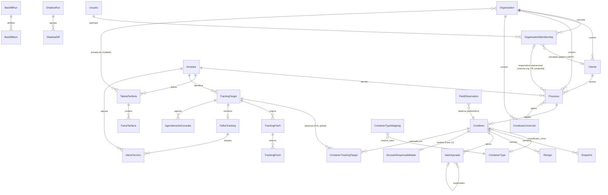

# Plano de Migração — Demurrage V1 → Demurrage Engine V2

**Data:** 24/09/2026 (revisão 4)
**Base:** `docs/demurrage-blueprint-gap-analysis.md` (diagnóstico aprovado, com as 3 correções de premissa da revisão 1)
**Status:** schema aprovado para avançar à Fase 1, com 6 decisões finais obrigatórias (lista abaixo). A implementação da Fase 1 está em andamento neste momento — ver relatório de entrega no final deste documento.

## Decisões finais desta revisão (obrigatórias, incorporadas ao schema e à implementação)

1. **Multiempresa desde a fundação.** `Organization` + `OrganizationMembership` desde a primeira migration. `Usuario` continua sendo a identidade global da pessoa (vinculada ao `home_account_id` do MSAL já existente); o papel (`ANALYST`/`MANAGER`/`ADMIN`/`CLIENT`) vive em `OrganizationMembership`, por organização. Entidades de tenant (`Cliente`, `Processo`, `CondicaoComercial`, tabelas tarifárias privadas, dados derivados de Processo/Contêiner) carregam `organization_id` direto ou por relacionamento inequívoco; unicidades antes globais passam a ser escopadas por organização (ex.: `UNIQUE(organization_id, numero_processo)`).
2. **PostgreSQL definitivo desde a Fase 1** — sem SQLite intermediário. Uso de FKs, unique constraints, índices compostos/parciais e transações nativas do Postgres para integridade; nenhuma dependência de fornecedor além do próprio Postgres.
3. **Não existe fato gerador universal.** `CondicaoComercial` perde `fato_gerador_data` como campo genérico. Os três motores comerciais (`TermoPorEmbarqueEngine`, `TermoUnicoEngine`, `ExposicaoRocketEngine`) continuam isolados e cada um determina sua própria regra temporal/tarifária; `ValorApurado` (Fase 4) passa a registrar explicitamente motor, versão do motor, tabela+versão, regra/day-count basis aplicada, período, inputs relevantes, resultado, status de confirmação e hash dos inputs — reconstruível sem depender da regra atual do sistema.
4. **Todos os ajustes da revisão 3 são preservados** (campos críticos tipados + `FieldObservation`, `Relogio` como cache, `TrackingTarget`, `TrackingFetch`×`TrackingEvent`, dedupe hash, `ContainerType`×`ContainerTypeMapping`, `confirmation_status`×`calculation_status`, qualidade de tabela × confirmação de custo, `day_count_basis`, datas civis, `BackfillRun`+`BackfillItem`, `ShadowRun`+`ShadowDiff`, supressão de alerta por incidente, HBL/responsável/condição comercial em Processo).
5. **Governança durante a implementação:** o Blueprint continua sendo a fonte de verdade funcional. Nenhuma regra de negócio, fluxo, estado, fonte de verdade, permissão, cálculo, prioridade, tracking ou estrutura aprovada é alterada para simplificar a implementação. Quando a implementação encontrar uma necessidade real de mudar algo já aprovado, a regra é **parar antes de implementar** e reportar `PRECISA DE SUA VALIDAÇÃO` com: o que foi encontrado, por que a estrutura atual gera problema, alternativas, impactos de cada uma, e recomendação. Decisões puramente técnicas que preservam integralmente o comportamento aprovado seguem normalmente, sem parar.
6. **Fase 1 implementada nesta revisão** — ver seção "Relatório de entrega — Fase 1" ao final do documento.

## Ajustes incorporados na revisão 2 (mantidos)

1. Estratégia explícita de bootstrap/backfill para processos já ativos na virada para V2 — nada ausente é inventado, tudo vira pendência rastreável (ver Fase 1).
2. Contrato do Tracking Service expandido: timestamp da coleta, fonte/armador, identificador original do evento, status da consulta e referência ao dado bruto para auditoria (ver Fase 5).
3. Princípio de arquitetura explícito: a Demurrage V2 é exclusivamente consumidora do Tracking Service central — nunca acessa Scrapfly ou o armador diretamente (ver abaixo e Fase 5).
4. Shadow mode adicionado antes do corte de frontend: V1 permanece produtiva enquanto V2 calcula os mesmos processos em paralelo, só para comparação (ver "Estratégia de coexistência e corte").
5. Idempotência explícita para scheduler, ingestão de eventos e alertas — contra execução/disparo duplicado (ver Fases 5 e 6).
6. Fixtures oficiais de cálculo como pré-requisito bloqueante das Fases 2–4, cobrindo off-by-one, House×Master, múltiplos contêineres, mudança de faixa, Empty Return, minuta e tabelas provisórias (nova seção antes da Fase 2).
7. Separação explícita dos três motores comerciais (Termo por Embarque, Termo Único, Exposição Rocket) como estratégias distintas, não uma função genérica (ver Fase 4).

## Correções de premissa incorporadas (vs. o diagnóstico anterior)

1. **Tracking de armador já existe na Priora** fora deste repositório/módulo. Não será construído um novo scraper/integração. Ver "Busca realizada" e "Contrato assumido" na Fase 5.
2. **Liberação é desacoplada.** A pré-análise de responsabilidade Rocket × cliente (Cap. 26 do Blueprint) não bloqueia o Demurrage Core. Ela entra como módulo plugável na Fase 11, consumindo eventos estruturados da Liberação quando existirem — sem gate no fechamento operacional (Fase 8).
3. **RBAC inicial:** `ANALYST`, `MANAGER`, `ADMIN`, `CLIENT`. "Responsável técnico/desenvolvedor" deixa de ser um papel de sistema e passa a ser um **destinatário configurável de alertas técnicos** (lista de e-mail/webhook em configuração, sem login nem permissões no app).

## Princípio geral: sem reescrita destrutiva

A V1 (`src/demurrage/*`, `src/routes/demurrageRoutes.ts`, `public/Demurrage.dc.html`, `public/PortalCliente.dc.html`) **permanece intocada e funcional** até o momento explícito de corte descrito na seção "Estratégia de coexistência e corte" mais abaixo. A V2 nasce em um namespace novo (`src/demurrage-engine/*` — nome proposto, ajustável), com sua própria rota (`/api/demurrage/v2` ou equivalente), sua própria persistência e seus próprios testes, sem tocar nos arquivos da V1 até que uma fase específica diga explicitamente "agora sim, isto afeta a V1".

## Princípio de arquitetura: única porta de saída para tracking

A partir da Fase 5, **toda** a Demurrage V2 (motor, scheduler, UI, Gestão) consome tracking exclusivamente através do Tracking Service central da Priora. Nenhum código de `src/demurrage-engine/*` faz — nem pode fazer — chamada direta a Scrapfly, a um endpoint de armador, ou a qualquer scraper. O adaptador `armadorTrackingSource.ts` (Fase 5) é a única peça do sistema autorizada a conhecer a existência do Tracking Service; todo o resto do motor conhece apenas a porta `ContainerDataSource` (Fase 1), agnóstica de onde o dado veio. Isso vale também para o scheduler (Fase 6): ele decide **quando** pedir uma atualização, nunca **como** — o "como" é sempre delegado ao mesmo adaptador único.

Cada fase abaixo segue este roteiro fixo: **objetivo · arquivos/modelos novos · arquivos existentes afetados · migrations · dependências · testes obrigatórios · condição de aceite · risco de regressão.**

---

## Busca realizada para a correção #1 (tracking de armador)

Antes de propor a Fase 5, busquei o conector/serviço existente:
- Grep completo neste repositório por armador/carrier/MSC/Maersk/Hapag/CMA CGM/ONE/Evergreen/COSCO/OOCL/ZIM/Yang Ming/HMM/PIL/vessel/discharge/gate out/empty return — **nenhum resultado fora de listas de palavras-chave de e-mail** (`demurrageFilters.ts`, `auditoria/*`). O único tracking real implementado é `src/fedex/fedexClient.ts` e `src/dhl/dhlClient.ts` (courier de encomenda, domínio diferente).
- `render.yaml` não referencia nenhum serviço de tracking de armador nem variável de ambiente correspondente.
- Verifiquei os outros dois repositórios visíveis nesta sessão (`alvaroh2903-star/desktop-tutorial`, `alvaroh2903-star/miamoohelem`) — nenhum tem relação com logística/tracking (um é um stub vazio do tutorial do GitHub Desktop, o outro é uma loja de bebidas/sobremesas em React+Supabase).

**Conclusão:** o serviço existe, mas **fora do alcance desta sessão** (outro repositório/serviço interno da Priora não conectado aqui). A Fase 5 não pode nomear o serviço com certeza — ela define o **contrato de consumo assumido** e trata a obtenção de acesso/documentação real como pré-condição de início da fase, não como parte do escopo de código da fase.

---

## Trilhos transversais (não são fases numeradas, mas correm em paralelo)

Estes dois trilhos não aparecem na lista de 12 fases do pedido, mas são pré-requisito de ações específicas dentro delas — por isso ficam registrados aqui em vez de forçar uma 13ª fase:

**T1 — RBAC (`ANALYST`/`MANAGER`/`ADMIN`/`CLIENT`) + auditoria genérica.**
Necessário *antes* de qualquer ação com gate de papel aparecer em fases posteriores: atualização manual de tracking (Fase 6, exclusiva de `MANAGER`/`ADMIN`), correção de dado crítico e reabertura de processo (Fase 8), e a própria existência do papel `CLIENT` como pré-condição do Portal (Fase 12). Pode ser desenvolvido em paralelo às Fases 1–4, já que é ortogonal ao motor de cálculo. Não altera `requireAuth.ts` da V1 nem nenhuma rota existente — nasce como camada nova (`src/auth/roles.ts` ou `src/demurrage-engine/rbac/`) que só passa a ser consumida pelas rotas novas da V2.

**T2 — Alertas técnicos configuráveis.**
Lista de destinatários (e-mail/webhook) configurada via `config.ts`/variável de ambiente (ex.: `TRACKING_ALERT_RECIPIENTS`), consumida pela Fase 6 (3 falhas consecutivas → alerta ao `MANAGER` responsável pelo processo + a esses destinatários técnicos). Não é um papel de RBAC, é config pura — sem tela de gestão de usuário associada nesta V1 do RBAC.

---

## Fase 1 — Modelo persistente por contêiner

**Objetivo:** substituir o "recalcula tudo a cada `GET`" por um registro persistente e versionado por contêiner, que é o alicerce de todas as fases seguintes. Introduzir a abstração de fonte de dados (`ContainerDataSource`) já prevista para acomodar, mais tarde, o Tracking Service real (Fase 5) sem retrabalho.

**Arquivos/modelos novos** (lista real do que foi construído no "Relatório de entrega — Fase 1"):
- `src/demurrage-engine/domain/types.ts` (tipos de domínio de todas as entidades da Fase 1 — Contêiner com os campos críticos tipados, Snapshot, identidade/organização, backfill).
- `src/demurrage-engine/persistence/fieldObservationRepository.ts` e `containerRepository.ts` (os campos críticos de `Contêiner` são colunas tipadas, cada uma com um ponteiro para a `FieldObservation` append-only que a originou — não um valor em tabela EAV genérica), mais os demais repositórios.
- `src/demurrage-engine/sources/containerDataSource.ts` (porta/interface).
- `src/demurrage-engine/sources/emailHeuristicSource.ts` (adaptador que **reaproveita** `demurrageFilters.ts` + `demurrageParser.ts` da V1 como fonte de contingência — ver nota abaixo).
- `src/demurrage-engine/db/migrations/*.sql` e `db/migrate.ts` (schema e runner PostgreSQL).

**Arquivos existentes afetados:** nenhum é modificado. `demurrageFilters.ts` e `demurrageParser.ts` são **importados/reaproveitados** por `emailHeuristicSource.ts`, não alterados — eles continuam servindo a V1 exatamente como hoje.

**Migrations:**
- Persistência em **PostgreSQL** (decisão final #2 da revisão 4). Migrations `0001`–`0006` em `src/demurrage-engine/db/migrations/`, aplicadas pelo runner `db/migrate.ts`.
- Schema: `Contêiner` com os campos críticos em colunas tipadas, cada uma com ponteiro para a `FieldObservation` (append-only) que a originou; `Snapshot`; `BackfillRun`/`BackfillItem`; identidade/organização — detalhado na seção "Schema — Fase 1" mais abaixo.
- **Backfill (não é migração de schema, é carga inicial):** rodar `emailHeuristicSource` uma vez sobre as threads atualmente identificadas pela V1 para popular a base V2 com um estado inicial equivalente ao que a V1 mostra hoje; e importar os registros existentes de `demurrage-minutas.json`/`demurrage-atividades.json` (via `procKey`) para os novos registros de contêiner/processo, preservando o que já foi feito operacionalmente (ex.: "minuta já solicitada" não pode ser perdido na virada).

**Estratégia de bootstrap para processos já ativos (ponto de atenção explícito):**
Quando a V2 entra em operação, já existem processos em pleno andamento (contêiner descarregado há dias, alguns já em demurrage) que a V1 está acompanhando via e-mail. O backfill **não inventa histórico que não existe**:
- Para cada contêiner identificado pela V1 hoje, o backfill cria o contêiner V2 com os campos que a heurística de e-mail conseguir extrair **no momento do backfill**, cada um registrado como `FieldObservation` de `fonte = 'email_heuristic'` e selecionado na coluna tipada correspondente do `Contêiner`.
- Todo campo que a V1 mostra como "a confirmar" (ou que a heurística de e-mail nunca conseguiu extrair) nasce na V2 **`null`, sem ponteiro de observação** — que é como o schema representa pendência. Nunca um valor plausível é fabricado para preencher a lacuna, mesmo que isso signifique que o contêiner nasça com o relógio do cliente ou da Rocket incompleto.
- **Não há tentativa de reconstruir a data de descarga retroativa** a partir de heurísticas (ex.: "data do primeiro e-mail que menciona o contêiner"). Se a Fase 5 (Tracking Service) ainda não estiver acoplada no momento do backfill, `discharge_date` nasce `null` para todo contêiner cuja única fonte disponível seja e-mail — mesmo que o texto do e-mail mencione uma data de retirada/Gate Out (esse valor vai para `gate_out_date`, nunca é usado como substituto silencioso da descarga).
- Cada execução do backfill grava um `BackfillRun` (contagem de processos processados, campos pendentes e erros) e um `BackfillItem` por processo/contêiner tocado — auditoria de quando/como cada registro "nasceu" na V2.
- O backfill é **idempotente**: reexecutá-lo sobre o mesmo conjunto de threads não duplica contêineres nem regride um campo já promovido a uma fonte melhor (ex.: se a Fase 5 já tiver preenchido `discharge_date` via tracking real, uma nova rodada de backfill de e-mail não pode sobrescrever esse valor — a hierarquia de fontes do Cap. 4 vale desde o primeiro backfill).

**Dependências:** PostgreSQL (decidido); nenhuma dependência de Fase 5 (Tracking Service) — a fonte inicial é a heurística de e-mail, tratada desde já como fonte de **contingência**, não prioritária (alinhado ao Cap. 4 do Blueprint: quando a Fase 5 acoplar o Tracking Service real, ele entra como fonte prioritária sem precisar redesenhar o modelo).

**Testes obrigatórios:**
- CRUD do repositório de contêiner com versionamento de snapshot (nova versão preserva a anterior, não sobrescreve).
- `emailHeuristicSource` produzindo o mesmo resultado que a V1 produz hoje para o mesmo conjunto de e-mails de teste (teste de caracterização, para garantir que a base V2 nasce equivalente à V1 e não diverge por acidente nesta fase).
- Backfill idempotente (rodar duas vezes não duplica registros nem regride campo já promovido a fonte melhor — teste explícito desse cenário).
- Teste dedicado de "nada é inventado": para um contêiner sem `discharge_date` em nenhuma fonte disponível no momento do backfill, o campo nasce `null`, nunca com um valor derivado de heurística de data de e-mail.

**Condição de aceite:** para um conjunto de threads de teste, a base V2 populada via backfill contém um contêiner por número de contêiner extraído, com cada campo crítico apontando para uma `FieldObservation` de fonte `email_heuristic` (ou `null`/sem ponteiro, quando não encontrado) e o mesmo valor que a V1 mostraria hoje; um `BackfillRun` com suas contagens agregadas; e um `BackfillItem` por contêiner processado, rastreando individualmente o resultado (`criado`/`pendencia_marcada`/etc.).

**Risco de regressão:** **nulo para a V1** (nenhum arquivo da V1 é alterado). Risco interno: erro no backfill pode gerar uma base V2 inconsistente — mitigado por rodar o backfill em ambiente de teste antes de qualquer uso real, por ele ser reexecutável (idempotente) sem side effect na V1, e pelo registro em `BackfillRun` permitir auditar exatamente o que cada execução fez.

---

## Fixtures oficiais de cálculo — pré-requisito bloqueante das Fases 2–4

Antes de escrever qualquer código das Fases 2, 3 e 4, um conjunto único de fixtures oficiais deve existir e ser revisado — todas as três fases (motor temporal, dois relógios, motor tarifário) são testadas contra o **mesmo** conjunto de casos, para garantir que não há divergência de premissa entre elas. As fixtures cobrem, no mínimo:

1. **Off-by-one:** a tabela literal do Cap. 23.1 do Blueprint (descarga 01/09, FT 14 dias → 14/09:0, 15/09:1, 16/09:2, 20/09:6), mais um caso de FT=0 confirmado e um caso de FT ausente (pendente).
2. **House × Master divergentes:** um contêiner onde o relógio do cliente vence antes do relógio da Rocket, outro onde é o inverso, e um onde os dois vencem no mesmo dia.
3. **Múltiplos contêineres por processo:** um processo com 3 contêineres em estados diferentes (um devolvido sem custo, um em demurrage, um ainda dentro do free time) — para validar que a consolidação no processo preserva o detalhamento individual (Cap. 3/25) e não "contamina" um contêiner com o estado de outro.
4. **Mudança de faixa tarifária:** um contêiner cujo free time é maior que o padrão da tabela do armador, fazendo a primeira diária cair numa faixa que não é a primeira (exemplo do Cap. 24), tanto para Termo Único (faixas paralelas ao FT) quanto para a tabela de armador (Cap. 24.3.1).
5. **Empty Return:** evento chegando antes da descarga (caso inválido, Cap. 31.5), evento com data retroativa recebido atrasado (Cap. 31.6), e o caso normal (encerra os dois relógios daquele contêiner, não afeta os demais do mesmo processo/BL).
6. **Minuta:** minuta com data igual ao Empty Return (caso trivial), minuta com data divergente (preserva as duas evidências, usa a da minuta), e minuta chegando depois de um fechamento sem custo, criando custo (vai para reabertura).
7. **Tabelas provisórias/incompletas:** um cálculo com a tabela da PIL (estimativa por ponto médio, sempre `ESTIMATED_PROVISIONAL`) e um com uma tabela incompleta (Yang Ming/COSCO/ZIM) caindo numa faixa sem dado (`UNAVAILABLE`, nunca aproximação por semelhança).

Essas fixtures vivem em um único arquivo compartilhado, `src/demurrage-engine/__fixtures__/casosOficiais.ts`, referenciado pelos testes das Fases 2, 3 e 4 — nunca duplicadas em cada fase. **Estado (revisão 5):** o arquivo foi criado como primeiro entregável da Fase 2, antes do `freeTimeClock`, com os casos do motor temporal (off-by-one, FT 0, FT ausente, virada de mês, virada de ano, fevereiro/ano bissexto, data final anterior à descarga, devolução no último dia livre e no primeiro dia de demurrage). As seções dos casos 2–7 acima (dois relógios, múltiplos contêineres, faixas, Empty Return, minuta, tabelas provisórias) já existem no arquivo, vazias, e são preenchidas quando as Fases 3 e 4 forem autorizadas.

---

## Fase 2 — Motor temporal e testes de off-by-one

**Objetivo:** implementar (e testar exaustivamente) a fórmula de contagem de dias do Cap. 6/23 do Blueprint, corrigindo os dois problemas identificados no diagnóstico: âncora temporal (`discharge_date`, não retirada/Gate Out) e o aparente off-by-one da V1. Este motor é **puro**: sem tracking, sem Outlook, sem banco como dependência do cálculo, sem tarifa, sem frontend e sem o dual clock (Fase 3).

**Regras obrigatórias (revisão 5):**
- A única âncora é `discharge_date`. Nenhum dado é inferido a partir de Gate Out.
- Input em data civil `YYYY-MM-DD`, nunca `Date` JavaScript como representação do dia operacional. Não há hora, fuso ou conversão UTC em nenhuma etapa.
- Dias corridos. Para FT de N dias: dia 1 = descarga; último dia livre = descarga + (N − 1); primeiro dia de demurrage = descarga + N; dias de demurrage contam do primeiro dia de demurrage até a data final, inclusive, e são 0 se a data final vier antes do primeiro dia de demurrage.
- FT ausente = `PENDING`, nunca zero. FT explicitamente igual a zero é válido e diferente de ausente.
- Data final anterior à descarga = resultado `INVALID` explícito, nunca um número negativo.
- Caso não definido pelo Blueprint que exija regra nova → `PRECISA DE SUA VALIDAÇÃO` antes de implementar.

**Arquivos/modelos novos:**
- `src/demurrage-engine/__fixtures__/casosOficiais.ts` (fixtures oficiais compartilhadas — criado antes do motor).
- `src/demurrage-engine/temporal/civilDate.ts` (data civil: validação, aritmética de dias, sem `Date`).
- `src/demurrage-engine/temporal/freeTimeClock.ts` (último dia livre, primeiro dia de demurrage e dias de demurrage, dada a descarga + N dias de FT + data final de apuração).
- `src/demurrage-engine/__tests__/civilDate.test.ts` e `src/demurrage-engine/__tests__/freeTimeClock.test.ts`.

**Arquivos existentes afetados:** nenhum.

**Migrations:** nenhuma. O motor não lê o banco; a coluna `discharge_date` (DATE) de `Contêiner` é quem o alimentará a partir da Fase 3. `gate_out_date` é informativo, nunca âncora.

**Dependências:** nenhuma em tempo de execução. Conceitualmente, a coluna `discharge_date` da Fase 1 é a origem futura do input.

**Testes obrigatórios:**
- Reprodução literal da tabela do Cap. 23.1 do Blueprint (descarga 01/09, FT 14 dias → 14/09:0, 15/09:1, 16/09:2, 20/09:6) — não negociáveis.
- FT = 0 confirmado por fonte → cobrança começa no dia da descarga (Cap. 31.3).
- FT ausente → `PENDING`, nunca tratado como zero.
- Virada de mês, virada de ano, fevereiro em ano bissexto.
- Data final anterior à descarga → `INVALID` explícito.
- Devolução no último dia livre (0 dias) e no primeiro dia de demurrage (1 dia).
- Pureza: o motor rejeita `Date`/timestamp como dia operacional e não importa banco, tracking, Outlook ou tarifa.

**Condição de aceite:** suíte de testes do motor temporal passando 100%, guiada pelas fixtures oficiais, incluindo a tabela literal do Blueprint. Nenhum outro código consome este motor ainda nesta fase — é aceito isoladamente.

**Risco de regressão:** nulo (código novo, não conectado a nada em produção ainda).

---

## Fase 3 — Dois relógios House × Master

**Objetivo:** aplicar o motor temporal da Fase 2 duas vezes por contêiner — uma para o relógio do cliente (House Free Time) e uma para o relógio da Rocket (Master Free Time) — mantendo os dois resultados sempre separados, nunca fundidos em um único "status genérico".

**Arquivos/modelos novos:**
- `src/demurrage-engine/domain/clock.ts` (`ClienteClock`/`RocketClock`: free time, fonte, último dia livre, primeiro dia de demurrage, dias de demurrage, estado).
- `src/demurrage-engine/temporal/dualClockCalculator.ts` (orquestra os dois `freeTimeClock` por contêiner).
- Extensão de `container.ts` (Fase 1) para carregar `clienteClock` e `rocketClock`.

**Arquivos existentes afetados:** nenhum arquivo da V1.

**Migrations:** nenhuma nova entidade — usa `master_free_time_days` (já tipado em `Contêiner`) e a entidade `Relogio` (uma linha por `tipo` — `cliente`/`rocket` — por contêiner), ambas definidas em "Schema — Fase 1".

**Dependências:** Fase 2 (motor temporal pronto e testado). Não depende de Fase 4/5 — Master Free Time pode vir inicialmente como `null`/pendente (fonte ainda não conectada) sem travar o desenvolvimento desta fase; o relógio do cliente já fica funcional isoladamente.

**Testes obrigatórios:**
- Caso onde só o relógio do cliente vence (Rocket ainda dentro do prazo) e vice-versa.
- Caso onde os dois vencem em datas diferentes — o resultado consolidado nunca deve "escolher um dos dois" para representar o contêiner.
- Caso Master Free Time ausente → cálculo do cliente continua normalmente (isolamento entre relógios, Cap. 12).

**Condição de aceite:** para um contêiner com House FT e Master FT diferentes (fixture), o motor retorna os dois relógios com seus próprios último-dia-livre e dias-de-demurrage, sem interferência mútua.

**Risco de regressão:** nulo (ainda não conectado a nenhuma rota pública).

---

## Fase 4 — Motor tarifário e versionamento

**Objetivo:** substituir o "número solto que a IA encontrou no e-mail" por um motor de tabelas versionadas — tabela Rocket×cliente (Termo por Embarque/Único) e as tabelas de armador do Cap. 24.3.1 — com faixas progressivas em paralelo ao free time e estados `CONFIRMED`/`ESTIMATED`/`ESTIMATED_PROVISIONAL`/`UNAVAILABLE`.

**Separação explícita dos três motores comerciais (não um cálculo genérico):**
o Blueprint trata Termo por Embarque, Termo Único e Exposição da Rocket como três regras de negócio diferentes (Cap. 24.1/24.2/24.3), com fontes de tabela, gatilhos de vigência e (no caso do Termo Único) lógica de faixa paralela ao free time distintos entre si. A Fase 4 implementa isso como **três estratégias nomeadas e isoláveis**, nunca uma função única "calcula tarifa" com `if`s internos:
- **`TermoPorEmbarqueEngine`** → usa a Tabela Rocket vinculada ao embarque/termo assinado (Cap. 24.1): `valor = dias_demurrage_cliente × diária da tabela Rocket para o tipo de equipamento`, versão fixada no processo.
- **`TermoUnicoEngine`** → usa a tabela vigente na data do fato gerador (Cap. 24.2), com o motor de faixas (`bracketEngine`) avançando em paralelo ao free time desde a descarga, sem reiniciar na primeira faixa ao fim do FT.
- **`ExposicaoRocketEngine`** → usa Master FT + tabela do armador (Cap. 24.3), com os estados `ESTIMATED`/`ESTIMATED_PROVISIONAL`/`CONFIRMED`/`UNAVAILABLE`, totalmente independente da tabela usada para o cliente.

Cada motor produz um `ValorApurado` com um campo `motorComercial` identificando qual dos três o gerou (rastreabilidade obrigatória — nunca dá pra confundir "quanto o cliente paga" com "quanto a Rocket está exposta").

**Arquivos/modelos novos:**
- `src/demurrage-engine/tariffs/tariffTable.ts` (entidade: armador/Rocket, tipo de equipamento, faixas, vigência, versão, status).
- `src/demurrage-engine/tariffs/bracketEngine.ts` (posiciona um dia na faixa certa, contando desde a data-âncora, sem reiniciar na 1ª faixa ao fim do free time — reaproveitado pelo `TermoUnicoEngine` e pelo `ExposicaoRocketEngine`, nunca pelo `TermoPorEmbarqueEngine`, que é tarifa fixa por dia).
- `src/demurrage-engine/tariffs/engines/termoPorEmbarqueEngine.ts`
- `src/demurrage-engine/tariffs/engines/termoUnicoEngine.ts`
- `src/demurrage-engine/tariffs/engines/exposicaoRocketEngine.ts`
- `src/demurrage-engine/tariffs/seed/` (dados iniciais: as 12 tabelas de armador + tabela Rocket×cliente, literalmente copiadas do Blueprint Cap. 24.1/24.3.1).
- `src/demurrage-engine/domain/containerType.ts` (normalização de tipo de contêiner + mapeamento — Cap. 9; mapeamento inicial vazio/mínimo, já que o próprio Blueprint deixa a tabela de equivalências como pendência dele mesmo).

**Arquivos existentes afetados:** nenhum arquivo da V1.

**Migrations:** tabelas `tariff_table`, `tariff_bracket`, `container_type_mapping`; seed inicial das tabelas do Blueprint.

**Dependências:** Fase 3 (dias de demurrage por relógio já calculados) para o motor tarifário ter "quantos dias" e "em qual data" aplicar a faixa. Não depende de Fase 5.

**Testes obrigatórios:**
- Exemplo do Cap. 24: contêiner com free time maior que o padrão da tabela do armador cai numa faixa posterior à primeira.
- PIL: estimativa por ponto médio, status sempre `ESTIMATED_PROVISIONAL`, nunca `CONFIRMED`.
- Tabelas incompletas (Yang Ming/COSCO/ZIM) retornando `UNAVAILABLE` nas faixas sem dado — nunca aproximação por semelhança.
- Tipo de contêiner não reconhecido → bloqueia só a seleção de tarifa, mantém os relógios ativos (Cap. 31.9).
- Um mesmo contêiner processado pelos três motores em paralelo (Termo por Embarque para o cliente, Exposição Rocket para o armador) produz dois `ValorApurado` com `motorComercial` diferentes e valores independentes — teste explícito de que nenhum motor lê ou influencia o resultado do outro.

**Condição de aceite:** para cada armador com tabela completa no Blueprint, o motor reproduz os valores de exemplo do próprio documento; para os incompletos, retorna `UNAVAILABLE`/`ESTIMATED_PROVISIONAL` conforme o caso, nunca um número inventado. Os três motores comerciais existem como módulos separados e testáveis isoladamente (nenhum teste de um motor depende de código dos outros dois).

**Risco de regressão:** nulo (motor isolado, sem consumidor em produção ainda).

---

## Fase 5 — Integração com o Tracking Service existente

**Objetivo:** conectar `ContainerDataSource` (Fase 1) a um novo adaptador que consome o **serviço de tracking de armador já existente na Priora** (fora deste repositório), promovendo-o a fonte prioritária conforme a hierarquia do Cap. 4 — sem construir nenhum scraper/integração nova. A `emailHeuristicSource` (Fase 1) passa a atuar exatamente como o Blueprint prevê: fonte de contingência, usada só quando o tracking estruturado não tiver o dado.

**Pré-condição de início (bloqueante, fora do controle de código):** obter, junto ao time responsável pelo serviço existente, (a) acesso/credenciais, e (b) o contrato real de request/resposta. Sem isso, esta fase não pode começar — ver "Busca realizada" acima.

**Princípio de fonte única (reforço):** `armadorTrackingSource.ts` é o **único** arquivo de todo o sistema autorizado a saber que o Tracking Service existe. Nenhum outro módulo da V2 — scheduler, motor de cálculo, UI, Gestão — chama Scrapfly, o armador ou qualquer conector diretamente; todos passam pela porta `ContainerDataSource`. Isso é tratado como regra de arquitetura, não sugestão: um code review que encontre uma chamada de rede fora deste único arquivo em direção a tracking é um bug de arquitetura, independente de funcionar ou não.

**Contrato assumido (a validar contra o serviço real assim que houver acesso) — expandido:**
- Entrada: identificador de armador + BL (House/Master) e/ou número de contêiner.
- Saída esperada, **por evento normalizado** (não só por contêiner — cada evento é um registro auditável independente):
  - tipo de evento (descarga, gate out, empty return, outro);
  - data do evento;
  - **timestamp da coleta** (quando o Tracking Service obteve esse dado do armador — distinto da data do evento em si);
  - **fonte/armador** (qual armador originou o evento);
  - **identificador original do evento** no Tracking Service (para deduplicação e para poder perguntar "de onde veio exatamente este dado" depois);
  - **status da consulta** (sucesso, falha, parcial);
  - **referência ao dado bruto** (um ponteiro/ID que permita, em auditoria, recuperar o payload original do armador que originou o evento — não necessariamente o payload inteiro trafegando em toda resposta, mas uma referência resolvível).
- Assumir que o serviço já resolve cache/consulta ao armador internamente (não duplicar cache na Priora se o serviço existente já fizer isso — a decisão exata depende do contrato real).

**Arquivos/modelos novos:**
- `src/demurrage-engine/sources/armadorTrackingSource.ts` (implementa `ContainerDataSource`, chamando o serviço existente via HTTP/SDK — a definir conforme o contrato real; **único ponto de contato com o Tracking Service em todo o sistema**).
- `src/demurrage-engine/sources/sourceHierarchy.ts` (orquestra prioridade: tracking do armador > House/MBL estruturado, quando existir > heurística de e-mail > `MANUAL_FALLBACK`).
- `src/demurrage-engine/sources/eventIngestion.ts` (registra a execução da consulta como `TrackingFetch`, normaliza a resposta em zero ou mais `TrackingEvent`, calcula `dedupe_hash` e decide se cada evento já foi processado — ver idempotência abaixo).

**Arquivos existentes afetados:** nenhum arquivo da V1. `config.ts` ganha uma nova seção (`trackingService: { baseUrl, apiKey, ... }`, nomes a definir com o contrato real).

**Migrations:** as entidades de tracking já desenhadas no schema (`TrackingTarget` global, o vínculo N:N `ContainerTrackingTarget`, `TrackingFetch`, `TrackingEvent` — ver "Schema — Fase 1", seção Tracking); nenhuma coluna de target é adicionada a `Contêiner`. Passa a popular os campos tipados já existentes em `Contêiner` (`discharge_date`, `master_free_time_days`, etc.) com observações de `fonte = 'tracking_service'` em vez de `'email_heuristic'` quando disponível, preservando ambos os valores em caso de divergência (Cap. 4: "a Priora mantém ambos os registros, aplica a hierarquia e sinaliza a divergência").

**Idempotência da ingestão (ponto de atenção explícito):** cada evento recebido do Tracking Service é deduplicado pelo `dedupe_hash` de `TrackingEvent` — calculado a partir do `external_event_id` quando o serviço fornecer um identificador estável, ou por um fallback determinístico (armador+target+tipo_evento+contêiner+data_evento) quando não fornecer. Reprocessar a mesma resposta do Tracking Service duas vezes (ex.: por retry de rede, por reprocessamento manual, por dois workers concorrentes) não cria dois eventos nem aplica o mesmo evento duas vezes ao relógio do contêiner — `eventIngestion.ts` verifica a chave antes de gravar e é seguro para chamada concorrente/repetida. Falhas de consulta (sem nenhum evento retornado) ficam registradas só em `TrackingFetch.status_consulta`, nunca geram um `TrackingEvent` fantasma.

**Dependências:** acesso ao serviço real (pré-condição acima); Fase 1 (porta `ContainerDataSource` já definida).

**Testes obrigatórios:**
- Contrato do adaptador testado contra um mock do serviço real (respostas de sucesso, falha, timeout).
- Divergência entre `armador_tracking` e `email_heuristic` para o mesmo campo → ambos preservados, hierarquia aplicada, divergência sinalizada (não silenciosa).
- Campo presente só na heurística de e-mail (tracking não retornou) → continua usável como contingência.
- **Idempotência:** o mesmo evento normalizado (mesmo `dedupe_hash`) ingerido duas vezes — inclusive de forma concorrente (duas chamadas simultâneas) — resulta em um único `TrackingEvent` gravado e um único efeito sobre o relógio do contêiner.
- Teste estático/arquitetural: nenhuma chamada de rede em direção a tracking existe fora de `armadorTrackingSource.ts` (pode ser um teste de lint/import-boundary, não só um teste funcional).

**Condição de aceite:** para um contêiner de teste, o adaptador retorna os campos do contrato assumido (incluindo timestamp de coleta, identificador original e referência ao dado bruto) e o `sourceHierarchy` prioriza corretamente `armador_tracking` sobre `email_heuristic` quando ambos têm valor. Reingestão do mesmo evento é comprovadamente um no-op.

**Risco de regressão:** nulo para a V1. Risco técnico principal desta fase: o contrato assumido acima pode não bater com o serviço real — o adaptador deve ser a **única** peça a mudar se o contrato real for diferente (por isso ele fica isolado atrás da porta `ContainerDataSource`, sem vazar formato específico do serviço para o resto do motor).

---

## Fase 6 — Scheduler e cadência

**Objetivo:** implementar a cadência automática do Cap. 16 (D0/D+5/D+9/D+13/D+17 → diário → a cada 2 dias em demurrage → suspensão aos 30 dias) e os alertas de falha do Cap. 18 (3 falhas consecutivas → `MANAGER` do processo + destinatários técnicos configuráveis — trilho T2).

**Arquivos/modelos novos:**
- `src/demurrage-engine/scheduler/cadencePolicy.ts` (função pura: dado o estado do contêiner + histórico, decide se/quando a próxima consulta deve ocorrer).
- `src/demurrage-engine/scheduler/schedulerWorker.ts` (job em background — mecanismo concreto, ex. `node-cron` ou execução periódica no próprio processo Node, a decidir conforme infra do Render disponível).
- `src/demurrage-engine/scheduler/failureTracker.ts` (contagem de falhas consecutivas por BL/armador, zera em sucesso, agrupa incidentes do mesmo armador).
- `src/demurrage-engine/alerts/technicalAlertRecipients.ts` (lê a lista configurável — trilho T2).

**Arquivos existentes afetados:** `src/config.ts` ganha `trackingAlertRecipients: string[]` (env var). Nenhum arquivo da V1.

**Migrations:** nenhuma nova além das já reservadas no schema (`FalhaTracking`, `AgendamentoConsulta`, `AlertaTecnico` — ver "Schema — Fase 1").

**Idempotência do scheduler e dos alertas (ponto de atenção explícito):**
- Cada disparo previsto pela cadência (uma "janela", ex.: "D+9 deste BL") tem uma **chave de idempotência** própria em `AgendamentoConsulta` (`tracking_target_id + janela_prevista`) — agendado por `TrackingTarget`, não por contêiner (ponto 3): um BL que alimenta vários contêineres é consultado uma vez só, não uma vez por contêiner. Antes de consultar o Tracking Service, o scheduler verifica se aquela janela já foi executada (ou está em execução); se sim, não dispara de novo — isso protege contra o próprio processo Node reiniciar no meio de um ciclo (comum no plano free do Render, que "dorme" por inatividade) e contra duas instâncias do worker rodarem simultaneamente por engano.
- Para alertas técnicos, o comportamento pedido é **suprimir, não só deduplicar**: a 3ª falha consecutiva de um `TrackingTarget` dispara um `AlertaTecnico` e marca `FalhaTracking.alerta_disparado = true`; a 4ª, 5ª... falha consecutiva **não** gera novo alerta, porque a condição de disparo (`contador_consecutivo=3 AND alerta_disparado=false`) deixou de ser satisfeita. Só um sucesso (que zera `contador_consecutivo` e `alerta_disparado`) seguido de uma nova sequência até 3 falhas (incrementando `incidente_seq`) libera um novo disparo — um incidente novo, não um reforço do mesmo.
- Esse desenho reaproveita o mesmo padrão de dedupe da ingestão de eventos (Fase 5) — chave/condição de idempotência + estado do que já foi processado — para manter a mesma lógica em todo o sistema, não inventar um mecanismo novo por fase.

**Dependências:** Fase 5 (a cadência só faz sentido chamando o adaptador real); trilho T2 (lista de destinatários configurável) e T1 (papel `MANAGER` já existir para receber o alerta operacional).

**Testes obrigatórios:**
- Simulação de relógio (mock de tempo) percorrendo D0→D+5→D+9→D+13→D+17→diário→a cada 2 dias→suspensão aos 30 dias, verificando a data da próxima consulta em cada etapa.
- Reaproveitamento: se outro consumidor já tiver tracking válido dentro da janela, a cadência não dispara nova consulta (Cap. 16.9) — depende do serviço real informar "quando foi obtido", conforme contrato da Fase 5.
- Falha consecutiva zera `contador_consecutivo`/`alerta_disparado` após sucesso; a 3ª falha consecutiva dispara **um** `AlertaTecnico` (com o `MANAGER` responsável e os destinatários técnicos configurados — T2 — como destinatários do mesmo registro, não dois alertas separados), agrupando por armador quando múltiplos targets são afetados simultaneamente.
- **Supressão (ponto 14):** simular uma 4ª e 5ª falha consecutiva após a 3ª já ter dispara o alerta — nenhum novo `AlertaTecnico` é criado. Só depois de uma consulta bem-sucedida (reset) e uma nova sequência até 3 falhas (novo `incidente_seq`) um novo alerta é permitido.
- **Idempotência do scheduler:** disparar o job da mesma janela duas vezes (simulando reinício do processo ou dupla execução) resulta em uma única consulta real ao Tracking Service.

**Condição de aceite:** para um contêiner de teste avançando no tempo simulado, o scheduler gera exatamente as consultas previstas pela cadência do Cap. 16 e suspende automaticamente aos 30 dias de demurrage sem Empty Return; reexecuções da mesma janela são comprovadamente no-op; uma sequência de 3, 4 e 5 falhas consecutivas gera exatamente **um** `AlertaTecnico`, não três.

**Risco de regressão:** nulo para a V1 (job novo, isolado). Risco operacional: um scheduler mal calibrado pode gerar volume de chamadas ao serviço de tracking real acima do esperado — mitigar rodando primeiro em ambiente de teste/staging com o adaptador mockado antes de apontar para o serviço real.

---

## Fase 7 — Estados/prioridade

**Objetivo:** implementar a máquina de estados por contêiner do Cap. 21 (~10 estados, incluindo as faixas de dias 1–6/7–14/15+) e a fila de prioridade de 5 níveis com desempate de 5 critérios do Cap. 22, substituindo a classificação simplificada (`custo_ativo`/`risco`/`pendencia`/`encerrado`/`indefinido`) da V1 **apenas no motor V2** — a V1 continua com sua própria classificação até o corte (ver seção de coexistência).

**Arquivos/modelos novos:**
- `src/demurrage-engine/lifecycle/containerState.ts` (máquina de estados do Cap. 21).
- `src/demurrage-engine/lifecycle/priorityEngine.ts` (5 níveis + 5 critérios de desempate do Cap. 22).

**Arquivos existentes afetados:** nenhum arquivo da V1.

**Migrations:** campo `estado` (enum ampliado) e `prioridade` + `motivoPrioridade` (texto, Cap. 28.5 — "cada card explica por que está na fila... em texto") na entidade Contêiner/Processo.

**Dependências:** Fases 3 (dois relógios), 6 (tracking desatualizado como um dos estados depende de saber a cadência esperada).

**Testes obrigatórios:**
- Transições de estado cobrindo os ~10 estados do Cap. 21, incluindo os limiares exatos (dia 6→7 crítico, dia 14→15 escalada).
- Ordenação da fila reproduzindo o exemplo de desempate do Cap. 22.7 (dias de demurrage > exposição Rocket existente > maior valor > tracking mais antigo/falha > menor tempo até vencimento).
- "Prazo próximo" nunca é rotulado como "Atenção"/"Crítico" (distinção explícita exigida pelo Cap. 21.2).

**Condição de aceite:** fixture com processos variados produz a mesma ordenação e os mesmos rótulos de prioridade que os exemplos do Cap. 22 do Blueprint.

**Risco de regressão:** nulo para a V1.

---

## Fase 8 — Empty Return/minuta/fechamento

**Objetivo:** implementar a detecção de devolução (Cap. 19), a distinção `trackingReturnDate` × `effective_return_date` da minuta (Cap. 19.1) e o fechamento operacional (Cap. 20/27.1) — **sem** gate de responsabilidade Rocket×cliente (correção de premissa #2: essa análise é plugável e chega na Fase 11; um processo pode fechar operacionalmente sem ela resolvida, ficando "responsabilidade em análise" como estado, não como bloqueio).

**Arquivos/modelos novos:**
- `src/demurrage-engine/closing/returnDetection.ts` (consome evento Empty Return do adaptador de tracking, Fase 5).
- `src/demurrage-engine/closing/minutaValidation.ts` (validação de minuta: nº de contêiner + data coerente → `effective_return_date`; divergência preserva as duas evidências).
- `src/demurrage-engine/closing/processClosure.ts` (estados separados do Cap. 20.3: interno da Rocket / documental do cliente / financeiro HeadCargo — este último inicialmente sempre "não disponível", já que HeadCargo é fora de escopo desta migração).
- `src/demurrage-engine/closing/reopening.ts` (reabertura restrita a `MANAGER`/`ADMIN` + justificativa, preservando valores anteriores).

**Arquivos existentes afetados:** nenhum arquivo da V1. `src/demurrage/demurrageStore.ts` (minuta solicitada + atividades) é **lido** no backfill da Fase 1, mas a partir da Fase 8 a V2 passa a ter seu próprio fluxo de minuta — a ação "solicitar minuta" da V1 (que cria rascunho no Outlook) pode ser reaproveitada como está, já que é só uma ação de e-mail, não faz parte do motor de cálculo.

**Migrations:** campos `trackingReturnDate`, `effectiveReturnDate`, `minutaDivergence`, estado `responsabilidade: 'em_analise' | 'confirmada_rocket' | 'confirmada_cliente' | 'dividida'` (valor default `em_analise`, sem bloquear fechamento).

**Dependências:** Fase 5 (evento Empty Return estruturado), Fase 7 (estados). T1 (papéis `MANAGER`/`ADMIN` para reabertura).

**Testes obrigatórios:**
- Minuta com data diferente do Empty Return → preserva as duas, usa a da minuta, registra divergência (Cap. 19.1).
- Processo sem custo concluído internamente mesmo com minuta pendente (Cap. 20.1) — confirma que a ausência de análise de responsabilidade **não** impede esse fechamento (validação direta da correção de premissa #2).
- Minuta chegando depois de um fechamento sem custo e criando custo → vai para reabertura (`MANAGER`), não recalcula silenciosamente (Cap. 19.1 último parágrafo).

**Condição de aceite:** ciclo completo simulado (descarga → free time → demurrage → Empty Return → minuta) fecha o processo operacionalmente sem exigir responsabilidade resolvida, e reabre corretamente quando uma minuta divergente chega depois.

**Risco de regressão:** nulo para a V1. Ponto de atenção: se a ação "solicitar minuta" for reaproveitada da V1 (`src/routes/demurrageRoutes.ts`), garantir que ela grave o evento tanto no `demurrageStore.ts` (V1, para não quebrar a tela atual) quanto no novo modelo (V2) enquanto as duas coexistirem — evitar que uma ação do operador apareça numa tela e não na outra.

---

## Fase 9 — UI operacional

**Objetivo:** construir a tela operacional V2 (Cap. 28/29: dois relógios visíveis separadamente, MBL/armador no card, filtros do Cap. 28.7, linha do tempo, ações de Gestor) **como uma tela nova**, mantendo `Demurrage.dc.html` (V1) funcionando em paralelo até o corte controlado (ver seção de coexistência abaixo, que detalha exatamente este ponto conforme pedido).

**Arquivos/modelos novos:**
- Novo endpoint `GET /api/demurrage/v2` (ou `/api/demurrage-engine`) em `src/routes/demurrageEngineRoutes.ts`, servindo o payload do motor V2.
- Nova tela `public/DemurrageV2.dc.html` (nome de trabalho) ou uma variante da existente controlada por flag — a decidir na hora, mas **sem sobrescrever** `Demurrage.dc.html` até o corte.
- Endpoints auxiliares: histórico/timeline do processo, filtros (Cap. 28.7), ação de correção de dado (gated por RBAC), botão "Atualizar tracking" (gated por `MANAGER`/`ADMIN`, respeitando cooldown de 2h da Fase 6/T1).

**Arquivos existentes afetados:** `src/index.ts` ganha o novo mount de rota (adição, não alteração da rota V1). `Demurrage.dc.html` só é tocado no momento do corte, não antes.

**Migrations:** nenhuma nova (consome o que já existe das Fases 1–8).

**Dependências:** Fases 1–8 completas o suficiente para o payload ter dado real; T1 (RBAC) para os gates de ação; **shadow mode concluído** (seção "Estratégia de coexistência e corte") — nenhuma tela V2 é exposta antes de todas as diferenças V1×V2 estarem catalogadas e explicadas.

**Testes obrigatórios:**
- Contrato do novo endpoint (schema do payload) coberto por teste, incluindo os campos que o Cap. 28.2/28.4 exigem (MBL, armador, os dois relógios separados, etc.).
- Teste de que ações restritas (correção de dado, atualizar tracking) retornam 403 para papéis sem permissão.
- Teste de regressão cruzada: `GET /api/demurrage` (V1) continua respondendo exatamente como antes, mesmo com a V2 montada no mesmo processo Express.

**Condição de aceite:** a tela V2 é navegável em paralelo à V1 (ex.: acessível por uma URL/flag separada), mostrando os dois relógios e os filtros, sem que a V1 apresente qualquer diferença de comportamento.

**Risco de regressão:** baixo, mas não nulo — é a primeira fase que toca `src/index.ts` (adição de rota) e potencialmente compartilha middlewares (sessão, `requireAuth`) com a V1. Mitigação: testes de regressão da V1 rodando no CI a cada mudança desta fase em diante.

---

## Fase 10 — Gestão

**Objetivo:** construir a visão de Gestão do Cap. 30 (indicadores operacionais, financeiros somente-leitura, responsabilidade Rocket, qualidade de tracking, segregação por moeda), consumindo os dados já existentes das Fases 1–9. Não introduz cálculo novo, é camada de agregação/apresentação.

**Arquivos/modelos novos:**
- `src/demurrage-engine/reporting/managementIndicators.ts` (agregações do Cap. 30.1–30.6).
- Nova tela/rota `GET /api/demurrage/v2/gestao` + view correspondente (gated por `MANAGER`/`ADMIN`).

**Arquivos existentes afetados:** nenhum.

**Migrations:** possivelmente índices de consulta para acelerar agregação (dependendo do motor de persistência escolhido na Fase 1) — não é migração de schema de domínio, é otimização.

**Dependências:** Fases 1–9 (precisa de volume real de dados para os indicadores fazerem sentido); T1 (gate de papel).

**Testes obrigatórios:**
- Cada indicador do Cap. 30.1/30.2/30.4/30.5 testado contra uma base fixture conhecida (valor esperado calculado à mão).
- Segregação por moeda: nenhum total soma USD+BRL sem conversão explícita (Cap. 30.6) — teste garantindo que valores em moedas diferentes nunca aparecem somados sem indicação de taxa/fonte.
- Todo indicador permite abrir sua composição (Cap. 30.7) — teste de que a agregação sempre carrega a lista de itens que a compõem, não só o total.

**Condição de aceite:** a tela de Gestão reflete corretamente os indicadores para a base de teste, com pendências/estimativas destacadas separadamente de valores confirmados.

**Risco de regressão:** nulo (tela nova, sem tocar V1).

---

## Fase 11 — Responsabilidade via Liberação

**Objetivo:** implementar a pré-análise de responsabilidade Rocket × cliente do Cap. 26 **como módulo plugável e opcional**, ativado somente quando o módulo Liberação expuser eventos estruturados (linha do tempo consultável). Até lá, o campo `responsabilidade` de todo contêiner permanece `em_analise` (default já estabelecido na Fase 8) sem nenhum efeito bloqueante — confirmando a correção de premissa #2 do usuário.

**Arquivos/modelos novos:**
- `src/demurrage-engine/responsibility/liberacaoTimelineSource.ts` (porta/interface — implementação real só quando a Liberação existir; até lá, um stub que sempre retorna "sem dados suficientes").
- `src/demurrage-engine/responsibility/responsibilitySuggestionEngine.ts` (interseção entre dias de demurrage e período de responsabilidade interna da Rocket, Cap. 26.2).
- Fluxo de confirmação do `MANAGER` (Cap. 26.3): confirmar Rocket / confirmar cliente / dividir / manter em análise, com registro completo da decisão (Cap. 26.4).

**Arquivos existentes afetados:** nenhum.

**Migrations:** entidade `responsibility_decision` (data apta, data efetiva, intervalo sugerido, dias confirmados, justificativa, evidências, gestor, timestamp).

**Dependências:** **bloqueada externamente** até o módulo Liberação existir/expor uma fonte consultável — esta fase pode ser desenvolvida e testada inteiramente com um `liberacaoTimelineSource` mockado, mas só entra em uso real quando a fonte real existir. Não bloqueia nenhuma fase anterior nem posterior (confirma a decisão do usuário de desacoplar).

**Testes obrigatórios:**
- Exemplo literal do Cap. 26.2 (demurrage 15/09, liberação possível em 15/09, liberação efetiva em 17/09, Empty Return 20/09 → sugestão 15–17 Rocket, 18–20 cliente).
- Evidência insuficiente → mantém `em_analise`, nunca presume responsabilidade (Cap. 26.1 último parágrafo).
- Confirmação do Gestor é a única ação que altera definitivamente o campo — sugestão sozinha nunca muda a cobrança exibida ao cliente (Cap. 26.3/26.4 último parágrafo — isso também é pré-requisito direto da Fase 12).

**Condição de aceite:** com o `liberacaoTimelineSource` mockado, o motor reproduz o exemplo do Cap. 26.2 e respeita o fluxo de confirmação humana. Com a fonte real ausente (caso de hoje), todo contêiner permanece `em_analise` sem erro nem bloqueio.

**Risco de regressão:** nulo — módulo aditivo e desligado por padrão até a fonte real existir.

---

## Fase 12 — Portal do Cliente

**Objetivo:** substituir o mock estático da aba Demurrage de `PortalCliente.dc.html` por um endpoint **dedicado e filtrado**, implementando a lista de campos permitidos/proibidos do Cap. 32.1/32.2 e as cores/estados do Cap. 32.3, para o papel `CLIENT` do RBAC.

**Arquivos/modelos novos:**
- `src/demurrage-engine/portal/clientPayloadBuilder.ts` (monta o payload do portal a partir do modelo interno, **nunca** reaproveitando o payload do endpoint do analista — mitigação direta do risco de vazamento identificado no diagnóstico, item D10).
- Nova rota `GET /api/demurrage/v2/portal/:processo` gated por `CLIENT` (só vê os próprios processos) e pelos demais papéis (para pré-visualização/QA).
- Teste de contrato "campo proibido nunca aparece" (lista fixa do Cap. 32.2, testada contra o payload real do portal a cada mudança futura — teste de regressão permanente).

**Arquivos existentes afetados:** `public/PortalCliente.dc.html` — a aba Demurrage passa a consumir o novo endpoint em vez do mock hard-coded no componente; nenhuma outra aba do portal é tocada.

**Migrations:** nenhuma nova.

**Dependências:** Fases 1–9 (dado real precisa existir), T1 (papel `CLIENT`), Fase 11 idealmente pronta (para garantir que nada da análise de responsabilidade escape — mas não é bloqueante, já que o payload é construído por lista de campos permitidos, não por exclusão).

**Testes obrigatórios:**
- Teste de contrato citado acima (nenhum campo do Cap. 32.2 no payload), rodando a cada build, não só uma vez.
- Estados/cores do Cap. 32.3, incluindo o caso explícito "0 dias restantes ainda é dentro do prazo, nunca aparece como demurrage".
- Cliente só enxerga os próprios processos (isolamento por identidade, não só por filtro de campo).
- Upload de minuta pelo portal não altera datas/valores até validação (Cap. 32.6).

**Condição de aceite:** para um processo de teste com dado de Rocket completo (Master FT, exposição, responsabilidade), o payload do portal não contém nenhum desses campos, mesmo que o payload interno do analista os tenha.

**Risco de regressão:** médio para o Portal (é a única fase que efetivamente substitui um comportamento visível da V1 — o mock atual). Mitigação: como o mock de hoje não reflete dado real nenhum, qualquer usuário que hoje vê a aba Demurrage do portal já está vendo dado fictício; a virada para dado real é, em si, uma correção, não uma regressão — mas deve ser comunicada como tal (o conteúdo muda de "exemplo" para "real").

---

## Estratégia de coexistência e corte (cutover) da API — atenção especial pedida

**Enquanto isso (Fases 1–8):** `GET /api/demurrage` (V1) e `Demurrage.dc.html` continuam servindo os usuários normalmente, sem nenhuma alteração de comportamento. A V2 evolui em arquivos, rotas e (na Fase 9) tela totalmente separados. Nenhum usuário é afetado nesse período.

**Shadow mode (novo estágio, obrigatório, entre o fim da Fase 8 e a exposição de qualquer tela V2 na Fase 9):**
Antes de qualquer usuário ver a V2, ela roda **sem UI e sem tráfego de usuário**, calculando os mesmos processos que a V1 está mostrando em produção, só para comparação:
- Um job de shadow (reaproveita o scheduler da Fase 6, ou um script dedicado) processa, em paralelo à V1, o mesmo conjunto de processos ativos, gerando o resultado completo da V2 (estados, dias de demurrage, valores) para cada um.
- Cada resultado V2 é comparado ao resultado que a V1 mostra **hoje** para o mesmo processo, e a diferença é gravada em `ShadowDiff` (ver schema) — nunca corrigida automaticamente, nunca exibida a nenhum usuário.
- Diferenças esperadas (ex.: V2 usa `discharge_date` e a V1 usa `dataRetirada` — Fase 2 corrigiu isso de propósito) são **catalogadas e explicadas**, não tratadas como bug; diferenças inesperadas (ex.: um contêiner que a V1 mostra em demurrage e a V2 não encontra) são investigadas antes de prosseguir.
- Critério para sair do shadow mode e entrar no "paralelo controlado" da Fase 9: todas as diferenças observadas estão catalogadas e explicadas (esperadas pela correção de regras, ou por lacuna de dado ainda pendente de fonte) — nenhuma diferença "misteriosa" sem explicação.
- O shadow mode não expõe nenhuma rota nova a usuários finais — é um processo interno/job, sem tela.

**Fase 9 (paralelo controlado, só depois do shadow mode ter sido concluído):** o novo endpoint (`GET /api/demurrage/v2`) e a nova tela ficam disponíveis **ao lado** da V1, atrás de uma flag de acesso (ex.: rota separada acessível só a quem souber o link, ou flag de config `DEMURRAGE_V2_ENABLED`). Isso permite validar a V2 com dado real em produção sem expor todos os usuários a ela.

**Corte (não é uma fase numerada — é um evento controlado, proposto para acontecer só depois da Fase 9 estar validada, tipicamente em paralelo às Fases 10–12):**
1. Trocar, em `public/Demurrage.dc.html` (ou por uma variável de config lida por `index.ts`), a URL que o front chama de `/api/demurrage` para `/api/demurrage/v2` — **atrás de flag**, reversível sem novo deploy (só mudando a config).
2. Rodar as duas rotas montadas simultaneamente por um período de observação (sugestão: até haver confiança operacional, sem prazo fixo imposto aqui — decisão do time operacional).
3. `GET /api/demurrage` (V1) **não é removida nesta migração** — o pedido foi evitar reescrita destrutiva, então o código V1 pode ficar como rota "legada" mantida por segurança até uma decisão explícita e futura de descomissionamento, fora do escopo deste plano.
4. Se qualquer problema aparecer na V2 em produção, reverter a flag imediatamente volta o front a consumir `/api/demurrage` (V1), que nunca parou de funcionar.

**Dado histórico:** como a V1 não tem persistência real (recalcula do e-mail a cada request), não há "dado histórico da V1" a migrar além do que já foi coberto no backfill da Fase 1 (`demurrage-minutas.json`/`demurrage-atividades.json`). Não há risco de perda de dado no corte, porque a V1 nunca guardou dado de cálculo — só ações do operador, já cobertas.

---

## Resumo de dependências entre fases (visão rápida)

```
Fase 1 ──► Fase 2 ──► Fase 3 ──► Fase 4
              │                    │
              └────────────────────┴──► Fase 5 (bloqueada por acesso externo) ──► Fase 6 ──► Fase 7 ──► Fase 8 ──► Fase 9 ──► Fase 10
                                                                                                            │
                                                                                    Fase 11 (paralela, plugável, sem bloquear) 
                                                                                                            │
                                                                                                         Fase 12
```

Fases 2, 3 e 4 são motores puros e podem ser desenvolvidas e 100% testadas por fixtures **antes** até de a Fase 5 ter acesso ao serviço real — não há motivo para esperar o acesso externo para começar o trabalho de cálculo. O único bloqueio externo real do plano inteiro é a Fase 5 (acesso ao Tracking Service existente); a Fase 11 depende de outro bloqueio externo (Liberação), mas foi desenhada para não travar nada além de si mesma.

---

# Schema — Fase 1 (revisão 4, aprovado e implementado)

**Status: APROVADO. Migrations escritas e aplicadas (ver "Relatório de entrega — Fase 1" ao final).** Esta revisão incorpora as 6 decisões finais da revisão 4 (multiempresa desde a fundação, PostgreSQL definitivo e a remoção de `fato_gerador_data` como premissa genérica de `CondicaoComercial`) e as aprovações da revisão 5 (responsável operacional via `OrganizationMembership`, `TrackingTarget` global com vínculo N:N). Tipos são conceituais nesta seção narrativa (TEXT, INTEGER, DATE, TIMESTAMP, BOOLEAN, ENUM, JSON) — o DDL real (tipos `UUID`/`JSONB`/`TIMESTAMPTZ` do Postgres) está nos arquivos `.sql` em `src/demurrage-engine/db/migrations/`.

**Nota de investigação (ponto 11):** verifiquei `src/routes/processRoutes.ts` — o único candidato a "registro central de Processo" já existente na Priora — e confirmei que ele também é *stateless* (monta "processos" ao vivo agrupando e-mail por `conversationId`, sem persistência). Não há hoje, neste código, nenhum cadastro central de Cliente/Processo para referenciar em vez de criar. `Cliente` e `Processo` abaixo nascem, portanto, como registros **locais e operacionais do módulo Demurrage**, não como cadastro corporativo — cada um leva um campo de referência externa nullable (`ref_externa`) reservado para o dia em que uma integração (HeadCargo ou outro cadastro central) existir, para então *linkar* em vez de duplicar. Já `Usuario` **evita** duplicar identidade: em vez de criar um sistema de contas paralelo, ele referencia o `homeAccountId` do MSAL que `requireAuth.ts` já usa — RBAC só adiciona `papel`/`cliente_id` em cima da identidade que já existe.

## Convenções

- **DATE** (data civil, sem hora) é usado em todo campo que participa da contagem de dias de demurrage (ponto 10) — nunca TIMESTAMP. O motor temporal trabalha só com datas civis: não há hora, não há fuso e não há conversão UTC em nenhuma etapa da contagem. A data civil de um evento é a data do evento como informada pela fonte; como um evento vindo do Tracking Service vira data civil é parte do contrato da Fase 5, nunca uma conversão feita pelo motor.
- **TIMESTAMP** (`TIMESTAMPTZ` no Postgres) é reservado para coleta/auditoria/execução (quando algo foi registrado pela Priora), nunca para contagem de dias.
- Toda entidade marcada **append-only** não sofre `UPDATE` de conteúdo — só `INSERT`, e isso é aplicado por *trigger* no Postgres, não só por convenção de código (ver Fase 1 implementada); quando uma transição de status é necessária (ex.: `ValorApurado.calculation_status`), é a única exceção documentada por entidade.
- **Multiempresa:** toda entidade de tenant carrega `organization_id` — direto quando é uma entidade "de primeira classe" (Cliente, Processo, CondicaoComercial, FieldObservation, Snapshot, BackfillRun, Contêiner), ou por relacionamento inequívoco quando é claramente subordinada a uma entidade que já o carrega (ex.: `BackfillItem` via `backfill_run_id`). Entidades de **dado de referência compartilhado** entre todas as organizações (Armador, ContainerType, ContainerTypeMapping) não carregam `organization_id` — MSC é o mesmo MSC para qualquer tenant da Priora. **`TrackingTarget` também é global** (revisão 5), assim como as entidades operacionais penduradas nele (`TrackingFetch`, `TrackingEvent`, `FalhaTracking`, `AgendamentoConsulta`): um mesmo MBL é a mesma consulta para qualquer consumidor. O isolamento multiempresa do tracking é feito pelo acesso via `Processo`/`Contêiner` (tabela de vínculo `ContainerTrackingTarget`) — compartilhar internamente o resultado bruto de um target não autoriza exposição entre organizações. `TabelaTarifaria` é o caso misto: `organization_id` **nullable** — `NULL` = tabela de referência pública/compartilhada (ex.: as tabelas de armador do Blueprint), preenchido = tabela privada negociada por uma organização (ex.: uma tabela Rocket×cliente específica). Toda constraint de unicidade que antes era global passa a ser escopada por organização (ex.: `UNIQUE(organization_id, numero_processo)`). A consistência de organização das referências é garantida no Postgres: por *trigger* no lado filho em `cliente_id`, `processo_id`, `condicao_comercial_id` e `entidade_id` polimórfico (migrations 0003/0004), e por **FK composta** em `responsavel_operacional_membership_id` (migration 0006). **Limitação conhecida (revisão 5):** os triggers só validam a escrita da linha filha — alterar o `organization_id` de uma linha *pai* já referenciada (ex.: mover um `Cliente` para outra organização) ainda não é bloqueado. Correção proposta aguardando validação — ver "Relatório de entrega — revisão 5", item `PRECISA DE SUA VALIDAÇÃO`.

## Entidades

### Identidade e organização

| Entidade | Campos principais | Constraints / unique keys |
|---|---|---|
| **Organization** | id, nome, slug, criado_em | UNIQUE(slug) |
| **Usuario** *(identidade global — não pertence a uma organização)* | id, nome, email, home_account_id (nullable — referência à identidade MSAL já existente em `requireAuth.ts`), criado_em | UNIQUE(email), UNIQUE(home_account_id) |
| **OrganizationMembership** | id, organization_id → Organization, usuario_id → Usuario, papel (`ANALYST`\|`MANAGER`\|`ADMIN`\|`CLIENT`), cliente_id → Cliente (nullable — só relevante quando papel=`CLIENT`; trigger garante que o `Cliente` referenciado pertence à mesma `organization_id`), criado_em | UNIQUE(organization_id, usuario_id) — leitura literal de "o papel" (singular) do pedido: um papel por pessoa por organização nesta V1 do RBAC. UNIQUE(id, organization_id) — chave candidata que sustenta a FK composta do responsável operacional (migration 0006). |

### Cadastro de referência (compartilhado entre organizações)

| Entidade | Campos principais | Constraints / unique keys |
|---|---|---|
| **Armador** | id, nome, codigo_interno | UNIQUE(codigo_interno) |
| **ContainerType** | id, codigo (ex. `40HC`), nome, categoria (`dry`\|`reefer`\|`open_top`\|`flat_rack`\|`especial`), tamanho_pes (`20`\|`40`\|`45`) | UNIQUE(codigo) |
| **ContainerTypeMapping** | id, valor_original, fonte, container_type_id → ContainerType, regra_aplicada, vigente_desde (DATE), vigente_ate (DATE, nullable) | UNIQUE(valor_original, fonte, vigente_desde) — permite reversionar sem apagar histórico |

### Núcleo operacional (escopado por organização)

| Entidade | Campos principais | Constraints / unique keys |
|---|---|---|
| **Cliente** | id, **organization_id** → Organization, nome, documento (nullable — Blueprint não define regra de unicidade, não inventada aqui), contatos (JSON), ref_externa (nullable), criado_em | — |
| **CondicaoComercial** | id, **organization_id** → Organization, termo_tipo (`embarque`\|`unico`), fonte_documental (nullable), criado_em. **`fato_gerador_data` removido** (decisão final #3) — não existe fato gerador genérico; cada motor comercial (Fase 4) determina sua própria regra temporal a partir do próprio instrumento. `tabela_id` → TabelaTarifaria é adicionado por `ALTER TABLE` só na Fase 4, quando a tabela existir — a entidade nasce mínima aqui. | — |
| **Processo** | id, **organization_id** → Organization, numero_processo (nullable — aprovado na revisão 5: processo ainda sem número identificado é pendência real, nunca placeholder), cliente_id → Cliente (nullable — idem), mbl, hbl (nullable), armador_id → Armador (referência global), condicao_comercial_id → CondicaoComercial (nullable), **responsavel_operacional_membership_id** → OrganizationMembership (nullable — revisão 5, migration 0006; substitui o antigo `responsavel_operacional_id → Usuario`, removido), ref_externa (nullable), criado_em | UNIQUE(organization_id, numero_processo) — vários `NULL` coexistem. Trigger garante `cliente_id` e `condicao_comercial_id` (quando presentes) da mesma `organization_id`. **FK composta** `(responsavel_operacional_membership_id, organization_id) → organization_memberships(id, organization_id)` garante o responsável da mesma organização nos dois sentidos (também impede mover para outra organização um membership que já é responsável); responsável `NULL` permitido; excluir membership que é responsável é bloqueado (o Blueprint não define reatribuição automática). |
| **Contêiner** | id, **organization_id** → Organization (denormalizado do Processo pai, com trigger de consistência — ver nota), processo_id → Processo, numero (ISO 6346), container_type_id → ContainerType (nullable, referência global), container_type_source_observation_id → FieldObservation (nullable), **discharge_date** (DATE, nullable) + discharge_date_observation_id, **house_free_time_days** (INTEGER, nullable) + house_free_time_observation_id, **master_free_time_days** (INTEGER, nullable) + master_free_time_observation_id, **gate_out_date** (DATE, nullable) + gate_out_observation_id, **tracking_return_date** (DATE, nullable) + tracking_return_observation_id, **effective_return_date** (DATE, nullable — derivado), criado_em, atualizado_em | UNIQUE(processo_id, numero) — já org-seguro por transitividade (o processo já é único por organização); `organization_id` denormalizado existe para índice/consulta direta e é validado por trigger contra `processo_id`. `estado`/`prioridade`/`motivo_prioridade` (Cap. 21) **não** entram na Fase 1 — nada os calcula ainda; entram no `ALTER TABLE` da Fase 7, decisão puramente técnica de sequenciamento (não muda regra aprovada). |

*Nota sobre `Contêiner`: os 7 campos em negrito são os dados críticos tipados (ponto 1 da revisão 3) — cada um é o valor **atualmente selecionado** pela hierarquia de fontes, com um ponteiro `<campo>_observation_id` apontando para o `FieldObservation` que o originou. `pendente` não precisa de enum próprio: é simplesmente o campo estar `null`. `effective_return_date` é recalculado (não é uma observação direta) sempre que `tracking_return_date` ou uma `Minuta` validada mudam.*

*Vínculo com tracking (revisão 5): `Contêiner` **não** tem coluna de target de tracking. A relação é N:N pela tabela `ContainerTrackingTarget` (Fase 5) — um target (ex.: um MBL) alimenta vários contêineres, e um contêiner pode ser coberto por mais de um target (ex.: MBL e o próprio número do contêiner).*

| Entidade | Campos principais | Constraints / unique keys |
|---|---|---|
| **FieldObservation** *(append-only, protegido por trigger no Postgres)* | id, **organization_id** → Organization, entidade_tipo (`processo`\|`container`), entidade_id, campo, valor (JSONB), fonte (`tracking_service`\|`email_heuristic`\|`manual_fallback`\|`house_document`\|`master_bl`\|`headcargo`\|`outro`), observado_em (TIMESTAMPTZ), coletado_em (TIMESTAMPTZ), evidencia_ref (nullable), criado_por → Usuario (nullable), criado_em | UNIQUE(entidade_tipo, entidade_id, campo, fonte, observado_em) — **não limita quantas fontes distintas** observam o mesmo campo. Trigger garante `organization_id` bate com a organização real de `entidade_id` (via `processos`/`containers`, conforme `entidade_tipo`) — nunca uma observação "vaza" para a organização errada. |
| **Snapshot** *(append-only, protegido por trigger)* | id, **organization_id** → Organization, container_id → Contêiner, versao (INTEGER), criado_em, evento_origem_id (nullable — FK para `TrackingEvent`, adicionada na Fase 5), dados_congelados (JSONB) | UNIQUE(container_id, versao). Trigger garante `organization_id` = organização do `container_id`. |

### Relógio (projeção/cache) — Fase 2/3, não construído na Fase 1

| Entidade | Campos principais | Constraints / unique keys |
|---|---|---|
| **Relogio** *(projeção/cache — descartável, nunca fonte de verdade)* | id, container_id → Contêiner, tipo (`cliente`\|`rocket`), ultimo_dia_livre (DATE), primeiro_dia_demurrage (DATE), data_final_apuracao (DATE), dias_demurrage (INTEGER), estado (`aberto`\|`fechado`\|`pendente`), **calculated_at** (TIMESTAMP), **engine_version** (TEXT), **input_hash** (TEXT) | UNIQUE(container_id, tipo). `organization_id` não é coluna própria — herdado via `container_id` (é puro cache, recalculável; não há risco de vazamento entre organizações que sobreviva a um recomputo). |

### Tarifas — três motores comerciais explícitos — Fase 4, não construído na Fase 1

**Decisão final #3 (revisão 4):** não existe fato gerador universal. Cada motor abaixo é responsável por determinar sua própria regra temporal/tarifária a partir do instrumento que lhe é próprio — nenhum campo genérico em `CondicaoComercial` tenta representar isso de antemão.

| Entidade | Campos principais | Constraints / unique keys |
|---|---|---|
| **TabelaTarifaria** | id, **organization_id** (nullable — `NULL`=referência pública/compartilhada entre organizações, ex. tabelas de armador do Blueprint; preenchido=tabela privada de uma organização, ex. tabela Rocket×cliente negociada), tipo (`rocket_cliente`\|`armador`), armador_id → Armador (nullable), termo_comercial (`embarque`\|`unico`, nullable), versao, vigencia_inicio (DATE), vigencia_fim (DATE, nullable), **qualidade_fonte** (`OFICIAL_VALIDADA`\|`OFICIAL_NAO_VALIDADA`\|`PUBLICA_ESTIMATIVA`\|`PROVISORIA_INCOMPLETA`), **day_count_basis** (`since_discharge_absolute`\|`excess_over_free_time`), fonte | UNIQUE(organization_id, tipo, armador_id, termo_comercial, versao) — `NULL` em `organization_id` participa da unicidade normalmente (Postgres trata `NULL`s como não-conflitantes por padrão; se duas tabelas públicas idênticas precisarem ser impedidas, um índice único parcial `WHERE organization_id IS NULL` resolve — decisão de detalhe da Fase 4, não da Fase 1). |
| **FaixaTarifaria** | id, tabela_id → TabelaTarifaria, tipo_equipamento, dia_inicial (INTEGER), dia_final (INTEGER, nullable = aberto), valor_dia, moeda | UNIQUE(tabela_id, tipo_equipamento, dia_inicial) |
| **ValorApurado** *(append-only, exceto a transição de `calculation_status`)* | id, container_id → Contêiner, relogio_tipo (`cliente`\|`rocket`), **motor_comercial** (`termo_embarque`\|`termo_unico`\|`exposicao_armador`), tabela_id → TabelaTarifaria (nullable se UNAVAILABLE), versao_tabela, **day_count_basis_aplicada** (nullable — copiado no momento do cálculo, não lido de `TabelaTarifaria` em consultas futuras; `TermoPorEmbarqueEngine`, tarifa fixa, não usa faixa e deixa `null`), period_start (DATE), period_end (DATE), dias_cobrados (INTEGER), faixas_aplicadas (JSONB), total, moeda, **confirmation_status** (`ESTIMATED`\|`ESTIMATED_PROVISIONAL`\|`CONFIRMED`\|`UNAVAILABLE` — só chega a `CONFIRMED` com `custo_real_confirmado_ref` preenchido, nunca só por a tabela ser `OFICIAL_VALIDADA`), custo_real_confirmado_ref (nullable), **calculation_status** (`OPEN`\|`FINAL`\|`SUPERSEDED`), **engine_version**, **input_hash**, **supersedes_id** → ValorApurado (nullable), calculated_at, criado_em | Índice parcial único: no máximo um `ValorApurado` com `calculation_status IN ('OPEN','FINAL')` por (container_id, relogio_tipo, motor_comercial). `organization_id` herdado via `container_id`. |

*Os três motores (`TermoPorEmbarqueEngine` → `TabelaTarifaria.tipo='rocket_cliente', termo_comercial='embarque'`, tarifa fixa por dia, sem faixa; `TermoUnicoEngine` → `tipo='rocket_cliente', termo_comercial='unico'`, usa `FaixaTarifaria` + `day_count_basis`; `ExposicaoRocketEngine` → `tipo='armador'`, usa `FaixaTarifaria` + `day_count_basis` do armador) permanecem três estratégias de código isoláveis (Fase 4). A memória de cálculo em `ValorApurado` (`motor_comercial`, `engine_version`, `tabela_id`+`versao_tabela`, `day_count_basis_aplicada`, `period_start`/`period_end`, `faixas_aplicadas` como inputs relevantes, `total` como resultado, `confirmation_status`, `input_hash`) é suficiente para reconstruir **por que** um valor foi calculado sem depender da regra atual do sistema — exigência explícita da decisão final #3.*

### Tracking (target → fetch → evento) — Fase 5/6, não construído na Fase 1

**Desenho aprovado na revisão 5:** `TrackingTarget` é global/compartilhado (sem `organization_id`) e se liga aos contêineres por uma tabela N:N, `Contêiner ← ContainerTrackingTarget → TrackingTarget`. Um único target (ex.: um MBL) alimenta vários contêineres e pode ser reaproveitado entre consumidores sem duplicar consulta. Todas as entidades operacionais do tracking (`TrackingFetch`, `TrackingEvent`, `FalhaTracking`, `AgendamentoConsulta`, `AlertaTecnico`) operam **por `TrackingTarget`**, nunca por contêiner. O isolamento multiempresa continua no acesso: uma organização só enxerga o tracking pelos seus próprios `Contêiner`s — o compartilhamento interno do resultado bruto de um target nunca autoriza exposição entre organizações.

| Entidade | Campos principais | Constraints / unique keys |
|---|---|---|
| **TrackingTarget** *(global — sem organization_id)* | id, armador_id → Armador, reference_type (`bl_master`\|`bl_house`\|`container`), reference_value (TEXT) | UNIQUE(armador_id, reference_type, reference_value) |
| **ContainerTrackingTarget** *(vínculo N:N — escopado via Contêiner)* | container_id → Contêiner, tracking_target_id → TrackingTarget, criado_em | PRIMARY KEY/UNIQUE(container_id, tracking_target_id). Sem `organization_id` próprio: herda a organização pelo `container_id`, e é por ele que o acesso de cada organização ao tracking é filtrado. Se o vínculo deve registrar a própria proveniência (de onde se soube que o target cobre o contêiner) é detalhe da Fase 5. |
| **TrackingFetch** *(append-only após conclusão; global, por target)* | id, tracking_target_id → TrackingTarget, iniciado_em, finalizado_em (nullable), **status_consulta** (`sucesso`\|`falha`\|`parcial`\|`timeout`), erro_mensagem (nullable), origem_disparo (`scheduler`\|`manual`\|`shadow`\|`backfill`), usuario_id → Usuario (nullable, disparo manual — nunca exposto a outra organização que compartilhe o target), referencia_dado_bruto (nullable) | — |
| **TrackingEvent** *(append-only)* | id, tracking_fetch_id → TrackingFetch, tracking_target_id → TrackingTarget (denormalizado), tipo_evento (`descarga`\|`gate_out`\|`empty_return`\|`outro`), numero_contêiner (nullable — o evento pode ser do target inteiro), data_evento (DATE), **external_event_id** (nullable, ponto 5), **dedupe_hash** (NOT NULL — hash(external_event_id) quando existe; senão fallback determinístico hash(armador+target+tipo_evento+numero_contêiner+data_evento)), referencia_dado_bruto, criado_em | UNIQUE(tracking_target_id, dedupe_hash) |
| **FalhaTracking** | id, tracking_target_id → TrackingTarget, contador_consecutivo (INTEGER), **incidente_seq** (INTEGER, default 0 — incrementa cada vez que, após reset por sucesso, o contador volta a atingir 3), **alerta_disparado** (BOOLEAN), ultima_falha_em, ultima_resposta_valida_em, atualizado_em | UNIQUE(tracking_target_id) — global, uma sequência de falhas por target; atualizada in-place a cada `TrackingFetch` concluído para o target (incrementa em falha, zera `contador_consecutivo`+`alerta_disparado` em sucesso). |
| **AlertaTecnico** *(append-only)* | id, falha_tracking_id → FalhaTracking, incidente_seq (copiado no disparo), armador_id → Armador (denormalizado, para agrupar mensagem — Cap. 18 "34 processos afetados"), disparado_em, destinatarios (JSON) | UNIQUE(falha_tracking_id, incidente_seq) — **ponto 14:** dispara só na transição para a 3ª falha (`contador_consecutivo=3 AND alerta_disparado=false`); 4ª/5ª falha não geram novo alerta porque `alerta_disparado` já é `true`; só um sucesso (zera o contador) seguido de nova sequência até 3 (novo `incidente_seq`) libera um novo disparo. Com o target compartilhado, o alerta **operacional** ao Gestor precisa ser emitido por organização afetada e contar só os processos dela — nunca revelando a uma organização os processos de outra que compartilhe o target; como isso se reflete na unicidade do alerta é detalhe da Fase 6. |
| **AgendamentoConsulta** *(global, por target)* | id, tracking_target_id → TrackingTarget, janela_prevista (DATE), executado_em (TIMESTAMP, nullable), tracking_fetch_id → TrackingFetch (nullable), status (`pendente`\|`executado`\|`pulado_cache`) | UNIQUE(tracking_target_id, janela_prevista) — **ponto 3:** agendado por target, não por contêiner; quando um target alimenta vários contêineres (inclusive de organizações diferentes), uma janela cobre todos de uma vez. A cadência (Cap. 16) usa o estado mais urgente entre os contêineres vinculados ao target (via `ContainerTrackingTarget`) para decidir a próxima janela. |

### Encerramento, responsabilidade, evidências e auditoria — Fase 8/11, não construído na Fase 1

| Entidade | Campos principais | Constraints / unique keys |
|---|---|---|
| **Minuta** | id, container_id → Contêiner, data_informada (DATE), numero_contêiner_validado, data_validada (DATE, nullable — vira `effective_return_date`), diverge_do_tracking (BOOLEAN), usuario_id → Usuario, criado_em, estado_conferencia | — |
| **DecisaoResponsabilidade** | id, container_id → Contêiner, data_apta_liberacao (DATE), data_liberacao_efetiva (DATE), intervalo_sugerido_inicio (DATE), intervalo_sugerido_fim (DATE), dias_confirmados_rocket (INTEGER), dias_confirmados_cliente (INTEGER), justificativa, evidencias (JSON), gestor_id → Usuario, decidido_em, estado (`em_analise`\|`confirmada_rocket`\|`confirmada_cliente`\|`dividida`) | — (uma revisão cria novo registro; "vigente" = mais recente por contêiner) |
| **DocumentoEvidencia** *(append-only)* | id, entidade_tipo, entidade_id, tipo, origem, data_inclusao, usuario_id → Usuario, arquivo_ref | — |
| **Auditoria** *(append-only)* | id, entidade_tipo, entidade_id, campo, valor_anterior, valor_novo, usuario_id → Usuario, timestamp, motivo, evidencia_ref (nullable) | — |

### Operação da migração (backfill) — Fase 1, construído nesta etapa

| Entidade | Campos principais | Constraints / unique keys |
|---|---|---|
| **BackfillRun** *(operacional — mutável in-place, não append-only; ver nota)* | id, **organization_id** → Organization, executado_em, status (`em_andamento`\|`concluido`), processos_processados (INTEGER), campos_marcados_pendentes (INTEGER), erros (JSONB) | — |
| **BackfillItem** *(append-only, protegido por trigger)* | id, backfill_run_id → BackfillRun, entidade_tipo, entidade_id, resultado (`criado`\|`atualizado`\|`pendencia_marcada`\|`ignorado`\|`erro`), detalhe (JSONB), criado_em | — |

*Nota de refinamento sobre `BackfillRun` (decisão puramente técnica, não altera nenhuma regra aprovada): a revisão 3 marcava `BackfillRun` como append-only, mas seus contadores agregados só existem completos ao final da execução — mantê-lo estritamente append-only forçaria ou (a) uma linha por execução escrita só no fim, perdendo visibilidade de "em andamento", ou (b) um novo registro a cada incremento, o que não é o padrão de uso pretendido. `BackfillRun` passa para a classe **operacional** (como `FalhaTracking`), atualizado in-place; `BackfillItem` continua estritamente append-only — é ele quem carrega a rastreabilidade por item exigida (ponto 12).*

### Operação da migração (shadow) — Fase 9, não construído na Fase 1

| Entidade | Campos principais | Constraints / unique keys |
|---|---|---|
| **ShadowRun** *(append-only)* | id, iniciado_em, finalizado_em (nullable), **engine_version**, processos_comparados (INTEGER), diferencas_encontradas (INTEGER), diferencas_nao_explicadas (INTEGER), status (`em_andamento`\|`concluido`) | — |
| **ShadowDiff** *(append-only)* | id, shadow_run_id → ShadowRun, processo_id → Processo, container_id → Contêiner (nullable), campo, valor_v1, valor_v2, explicada (BOOLEAN), explicacao (nullable), comparado_em | — |

## Relacionamentos (Mermaid)



*(Linhas "polimórfico" = `entidade_tipo`+`entidade_id`, podendo apontar para `Processo` ou `Contêiner`; diagrama simplificado ao caso mais comum. Entidades das Fases 2–9/11 aparecem para mostrar a forma final do modelo, mas só `Organization`, `OrganizationMembership`, `Usuario`, `Armador`, `ContainerType`, `ContainerTypeMapping`, `Cliente`, `CondicaoComercial`, `Processo`, `Contêiner`, `FieldObservation`, `Snapshot`, `BackfillRun` e `BackfillItem` existem fisicamente após a Fase 1.)*

## Classificação das entidades

| Classe | Entidades | Regra |
|---|---|---|
| **Fonte de verdade — global/referência (sem organization_id)** | Usuario, Armador, ContainerType, ContainerTypeMapping, **TrackingTarget** (revisão 5) | Compartilhadas por todas as organizações. `Usuario` é a identidade da pessoa; o vínculo a uma organização e o papel vivem em `OrganizationMembership`. `TrackingTarget` é compartilhado para não duplicar consulta; o acesso de cada organização passa por `ContainerTrackingTarget` → `Contêiner`. |
| **Fonte de verdade — escopada por organização** | Organization (raiz), OrganizationMembership, Cliente, CondicaoComercial, Processo, Contêiner (colunas tipadas), ContainerTrackingTarget (via `container_id`), TabelaTarifaria (organization_id nullable), Minuta, DecisaoResponsabilidade | Mutáveis in-place; `organization_id` direto ou herdado por FK obrigatória, com consistência de organização garantida no Postgres (trigger no lado filho, ou FK composta no caso do responsável operacional). `Cliente`/`Processo` são locais ao módulo (ver nota de investigação), não um cadastro corporativo. |
| **Append-only (histórico imutável, protegido por trigger no Postgres)** | FieldObservation, Snapshot, ValorApurado (exceto a transição de `calculation_status`), TrackingFetch e TrackingEvent (globais, por target), AlertaTecnico, DocumentoEvidencia, Auditoria, BackfillItem, ShadowRun, ShadowDiff | Nunca `UPDATE`/`DELETE` de conteúdo — só `INSERT`, com essa garantia reforçada por *trigger* nas tabelas já implementadas (Fase 1). `ValorApurado` é o único caso com uma transição de status permitida. |
| **Operacional (mutável in-place, controle de execução — não é dado de negócio)** | FalhaTracking e AgendamentoConsulta (globais, por target), **BackfillRun** (aprovado como operacional na revisão 5) | Existem para coordenar scheduler/alertas/backfill, não para registrar fatos do domínio Demurrage em si. |
| **Projeção / cache (descartável)** | Relogio | Nunca é fonte de verdade; recalculável a qualquer momento sem perda de informação. |

## Relatório de entrega — Fase 1: Fundação persistente

### 0. `PRECISA DE SUA VALIDAÇÃO`

**Nenhum item.** Nenhuma regra de negócio, fluxo, estado, fonte de verdade, permissão, cálculo, prioridade, tracking ou estrutura aprovada precisou ser alterada para implementar a Fase 1. Três tensões técnicas apareceram durante a implementação e foram resolvidas com decisões que **preservam** o comportamento aprovado (não o mudam) — documentadas na Seção 8 abaixo para registro, não como bloqueio.

> **Atualização (revisão 5):** depois desta entrega foi identificada uma limitação na garantia multiempresa descrita na Seção 4 — os triggers validam só a escrita da linha filha, não a alteração de `organization_id` de uma linha pai já referenciada. Ver "Relatório de entrega — revisão 5", item `PRECISA DE SUA VALIDAÇÃO`. As decisões 1 e 3 da Seção 8 foram aprovadas pelo responsável do produto na revisão 5.

### 1. Arquivos criados

Todos novos, dentro de `src/demurrage-engine/` (25 arquivos) — nenhum arquivo existente da V1 foi modificado para criá-los:

```
src/demurrage-engine/
├── db/
│   ├── pool.ts                          — conexão PostgreSQL (DEMURRAGE_DATABASE_URL), parser de DATE como string
│   ├── migrate.ts                       — runner de migrations (aplica .sql pendentes, idempotente)
│   └── migrations/
│       ├── 0001_organizations_and_users.sql    — Organization, Usuario, OrganizationMembership
│       ├── 0002_reference_data.sql             — Armador, ContainerType, ContainerTypeMapping (globais)
│       ├── 0003_tenant_core.sql                — Cliente, CondicaoComercial, Processo + triggers de organização
│       ├── 0004_containers_and_observations.sql — Contêiner, FieldObservation, Snapshot + triggers append-only/organização
│       └── 0005_backfill.sql                   — BackfillRun, BackfillItem
├── domain/
│   └── types.ts                         — tipos de domínio (espelham as tabelas da Fase 1) + prioridade de fontes
├── sources/
│   ├── containerDataSource.ts           — porta ContainerDataSource<T> (Cap. 4 do Blueprint)
│   └── emailHeuristicSource.ts          — adaptador de CONTINGÊNCIA sobre demurrageFilters/demurrageParser da V1 (não alterados)
├── persistence/
│   ├── organizationRepository.ts
│   ├── usuarioRepository.ts
│   ├── organizationMembershipRepository.ts
│   ├── clienteRepository.ts
│   ├── processoRepository.ts
│   ├── containerRepository.ts           — inclui applyObservation() (resolução de hierarquia de fontes)
│   ├── fieldObservationRepository.ts
│   ├── snapshotRepository.ts
│   └── backfillRepository.ts
├── backfill/
│   └── runBackfill.ts                   — orquestrador do bootstrap/backfill idempotente
└── __tests__/
    ├── testDb.ts                        — helper de banco de teste (skip automático sem Postgres configurado)
    ├── migrate.test.ts
    ├── multiTenant.test.ts
    ├── fieldObservation.test.ts
    ├── emailHeuristicSource.test.ts
    └── backfill.test.ts
```

### 2. Arquivos existentes modificados (fora da V1)

| Arquivo | Mudança |
|---|---|
| `package.json` | + dependência `pg`, + devDependency `@types/pg`, + scripts `db:migrate:demurrage` e `test:demurrage-engine`. Script `test` original (V1/preAlerta) **não foi tocado**. |
| `package-lock.json` | Atualizado automaticamente pelo `npm install pg`. |
| `.env.example` | + bloco `DEMURRAGE_DATABASE_URL`/`DEMURRAGE_TEST_DATABASE_URL`, documentado como não usado por nenhuma outra parte da aplicação. Nada removido/alterado do que já existia. |
| `docs/demurrage-migration-plan-v1-to-v2.md` | Este documento (revisão 4 + este relatório). |

Nenhum arquivo de `src/demurrage/*`, `src/routes/demurrageRoutes.ts`, `public/Demurrage.dc.html`, `public/PortalCliente.dc.html`, `src/config.ts`, `src/middleware/requireAuth.ts`, `src/index.ts` ou qualquer outro módulo da V1 foi tocado.

### 3. Migrations criadas

5 arquivos `.sql`, aplicados em ordem por `src/demurrage-engine/db/migrate.ts` (transação por arquivo, registrado em `schema_migrations`). Resultado real de execução contra um banco novo (Postgres 16 local):

```
$ npm run db:migrate:demurrage
Migrations aplicadas: 5 [
  '0001_organizations_and_users.sql',
  '0002_reference_data.sql',
  '0003_tenant_core.sql',
  '0004_containers_and_observations.sql',
  '0005_backfill.sql'
]
Já estavam aplicadas: 0

$ npm run db:migrate:demurrage   # segunda execução
Migrations aplicadas: 0 []
Já estavam aplicadas: 5
```

### 4. Schema PostgreSQL final da Fase 1

14 tabelas físicas: `organizations`, `usuarios`, `organization_memberships`, `armadores`, `container_types`, `container_type_mappings`, `clientes`, `condicoes_comerciais`, `processos`, `containers`, `field_observations`, `snapshots`, `backfill_runs`, `backfill_items` (+ `schema_migrations`, controle do runner).

Guardrails implementados como **constraints e triggers reais do Postgres**, não como convenção de código:
- **Multiempresa:** trigger em `processos` (cliente e condição comercial da mesma organização), `containers` (mesma organização do processo), `field_observations` (mesma organização da entidade referenciada, resolvendo `processo`/`container` conforme `entidade_tipo`), `organization_memberships` (cliente da mesma organização quando papel=`CLIENT`). Unicidades escopadas: `UNIQUE(organization_id, numero_processo)`, `UNIQUE(organization_id, usuario_id)` em memberships.
- **Append-only:** função `forbid_mutation()` aplicada via trigger `BEFORE UPDATE OR DELETE` em `field_observations`, `snapshots` e `backfill_items` — `UPDATE`/`DELETE` retornam erro do Postgres, não é só uma convenção respeitada pelo código da aplicação.
- **Proveniência tipada:** `containers` tem os 7 campos críticos (`discharge_date`, `house_free_time_days`, `master_free_time_days`, `gate_out_date`, `tracking_return_date`, `effective_return_date`, `container_type_id`) cada um com sua coluna de ponteiro `*_observation_id` → `field_observations(id)`.
- `gen_random_uuid()` nativo do Postgres 16 (sem extensão `pgcrypto`) para todas as chaves primárias.

Schema completo consultável em `src/demurrage-engine/db/migrations/*.sql` (comentado linha a linha) e na seção "Schema — Fase 1 (revisão 4)" mais acima neste documento.

### 5. Testes executados e resultado

**Ambiente:** PostgreSQL 16.13 local (`priora_demurrage_test`), suíte rodada com `npm run test:demurrage-engine` (`node --test-concurrency=1`, arquivos sequenciais para evitar corrida no banco compartilhado entre eles).

```
$ npm run test:demurrage-engine
# tests 23
# suites 0
# pass 23
# fail 0
# cancelled 0
# skipped 0
# todo 0
```

Cobertura por arquivo:
- **`migrate.test.ts`** — aplica as 5 migrations em banco novo; reexecução é no-op; confere as 14 tabelas esperadas.
- **`multiTenant.test.ts`** (6 casos) — mesmo `numero_processo` em organizações diferentes é permitido; duplicado na mesma organização é rejeitado; `Processo` não pode referenciar `Cliente` de outra organização (trigger); `OrganizationMembership` não pode vincular `Cliente` de outra organização (trigger); papel por organização funciona; um usuário não pode ter dois memberships na mesma organização.
- **`fieldObservation.test.ts`** (5 casos) — mais de duas fontes concorrentes para o mesmo campo persistem todas; `UPDATE`/`DELETE` em `field_observations` são rejeitados pelo Postgres; `organization_id` divergente da entidade referenciada é rejeitado (trigger); `manual_fallback` não é rebaixado por uma observação `email_heuristic` posterior de valor diferente; `tracking_service` (maior prioridade) sobrescreve `manual_fallback`.
- **`emailHeuristicSource.test.ts`** (4 casos, sem Postgres) — mapeamento `dataRetirada → gateOutDate` (nunca `dischargeDate` — achado D1 do diagnóstico); campo ausente no e-mail não gera observação; thread sem sinal de demurrage não produz contêiner; thread com sinal forte extrai processo/contêiner via filtro determinístico (sem IA configurada neste ambiente).
- **`backfill.test.ts`** (4 casos) — primeira execução cria processo/cliente/contêiner com os campos observados e conta pendências corretamente; reexecução idêntica não duplica nada (mesma `observado_em` → mesma chave de `field_observations`); hierarquia respeitada durante o backfill (`manual_fallback` pré-existente sobrevive a uma nova observação `email_heuristic` de valor diferente); thread sem número de processo agrupa pelo primeiro contêiner (espelha a regra da V1) e é idempotente numa segunda execução.

**Regressão da V1 (fora do escopo desta fase, verificado por precaução):**
```
$ npm test          # suíte original (src/auditoria/preAlerta)
# tests 25 / pass 25 / fail 0

$ npm run build      # tsc completo, incluindo src/demurrage-engine/
(sem erros)

$ npx tsc --noEmit
(sem erros)
```
Smoke test manual do servidor V1 (`npm run dev` com credenciais fake): `GET /health` → `200`; `GET /` → `200`; `GET /api/demurrage` sem sessão → `401` — idêntico ao comportamento documentado na primeira revisão desta conversa.

### 6. Exemplo de backfill (execução real)

Rodado com um `ContainerDataSource` de teste controlado (para não depender de credenciais reais do Outlook/Gemini neste ambiente) — a mecânica de idempotência e hierarquia é a mesma usada por `emailHeuristicSource` em produção. Duas threads: uma com número de processo (`IM2151`) e campos observados, outra sem número de processo.

```jsonc
// Execução 1 (primeira carga)
{
  "runId": "614b3995-92bc-45a2-a516-bff6646eb957",
  "threadsProcessadas": 2,
  "processosProcessados": 2,
  "containersProcessados": 2,
  "camposMarcadosPendentes": 10,
  "erros": []
}

// Execução 2 (reexecução com as MESMAS threads) — idêntica, nada duplicado
{
  "runId": "98b0d21e-030d-45f7-9d20-ba210aecf384",
  "threadsProcessadas": 2,
  "processosProcessados": 2,
  "containersProcessados": 2,
  "camposMarcadosPendentes": 10,
  "erros": []
}
```

Estado final do contêiner `MSKU1234567` (processo `IM2151`) — note `dischargeDate`, `masterFreeTimeDays` e `trackingReturnDate` permanecendo `null` porque a fonte (e-mail) nunca os informou, exatamente como o ponto 1 da revisão exige ("nada inventado, vira pendência"):

```jsonc
{
  "numero": "MSKU1234567",
  "dischargeDate": null,               // nunca populado por e-mail — pendente até o Tracking Service (Fase 5)
  "dischargeDateObservationId": null,
  "houseFreeTimeDays": 14,
  "houseFreeTimeObservationId": "d6cbdf30-19f5-4a06-a7ad-3607510d447e",
  "masterFreeTimeDays": null,          // pendente — e-mail não é fonte aprovada
  "gateOutDate": "2026-01-10",
  "gateOutObservationId": "4650fb2a-520f-4d76-a1b9-2c98ec678318",
  "trackingReturnDate": null,
  "effectiveReturnDate": null
}
```

`BackfillItem`s da execução 1 (rastreabilidade por item, ponto 12): 2 processos (`criado` para `IM2151`, `pendencia_marcada` para o processo sem número identificado) e 2 contêineres (`criado` para ambos), cada um listando os campos observados e os campos que ficaram pendentes.

### 7. Confirmação: V1 não foi alterada

```
$ git status --short
 M .env.example
 M docs/demurrage-migration-plan-v1-to-v2.md
 M package-lock.json
 M package.json
?? src/demurrage-engine/

$ git diff --stat -- src/demurrage src/routes/demurrageRoutes.ts public/Demurrage.dc.html public/PortalCliente.dc.html
(vazio — nenhuma alteração)
```

`npm test` (suíte V1) e o smoke test manual do servidor confirmam comportamento idêntico ao documentado antes desta fase.

### 8. Decisões técnicas tomadas durante a implementação (não bloqueiam, registradas para transparência)

Nenhuma delas altera regra de negócio, fluxo, cálculo ou fonte de verdade aprovados — são ajustes de integridade/sequenciamento descobertos ao escrever o DDL real:

1. **`Processo.numero_processo` e `Processo.cliente_id` tornados `NULLABLE`.** O schema aprovado listava `cliente_id → Cliente` sem marcar nullability. Ao implementar o backfill contra o caso real (Gemini frequentemente retorna `cliente: null`, e uma thread pode não trazer o número do processo), exigir `NOT NULL` forçaria inventar um Cliente/número placeholder — violando diretamente o princípio já aprovado "nada é inventado, vira pendência" (ponto 1, revisão 2). Tornei ambos nullable, com `UNIQUE(organization_id, numero_processo)` continuando correta (Postgres trata múltiplos `NULL` como não-conflitantes). É a leitura que **preserva** o comportamento aprovado, não uma mudança dele.
2. **Parser de tipo `DATE` do driver `pg` fixado para retornar string, não `Date`.** Por padrão, `node-postgres` converte colunas `DATE` em objetos `Date` JavaScript (à meia-noite UTC) — o que reintroduziria exatamente a ambiguidade de fuso horário que o ponto 10 da revisão 4 ("datas civis, não timestamps") pede para evitar. Registrado `types.setTypeParser(1082, v => v)` em `db/pool.ts`. Sem isso, o requisito aprovado não seria cumprido de fato, apesar do tipo da coluna estar correto.
3. **`BackfillRun` reclassificado de *append-only* (revisão 3) para *operacional*/mutável in-place (revisão 4).** Seus contadores agregados só existem completos ao final da execução; mantê-lo append-only exigiria uma linha só ao final (perdendo visibilidade de "em andamento") ou um novo registro a cada incremento (fora do padrão de uso pretendido). `BackfillItem` continua estritamente append-only — é quem carrega a rastreabilidade por item exigida.
4. **`CondicaoComercial.tabela_id` e `Contêiner.estado/prioridade/motivo_prioridade` deliberadamente ausentes nesta migration** — apontam para entidades/lógica das Fases 4 e 7, que ainda não existem, e entram por `ALTER TABLE` quando essas fases começarem. O vínculo contêiner↔tracking também não existe na Fase 1 e, pelo desenho aprovado na revisão 5, **não** será uma coluna em `Contêiner`: nasce na Fase 5 como a tabela N:N `ContainerTrackingTarget`. Nenhum código da Fase 1 depende de nenhum deles.

### 9. Próximo passo

Fase 1 concluída e testada. **Não avanço para a Fase 2 sem nova autorização**, conforme solicitado.
